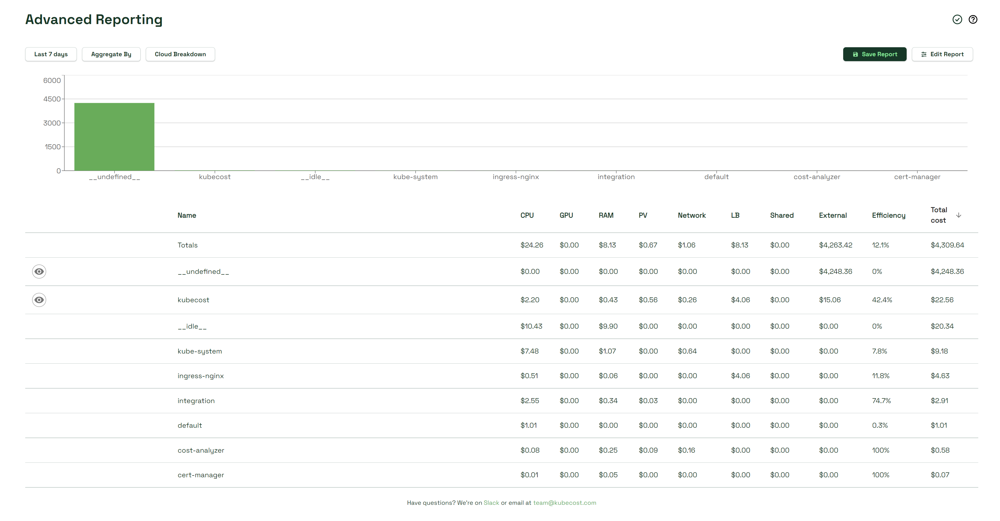

# Advanced Reporting

Kubecost Advanced Reporting allows teams to sculpt and tailor custom reports to easily view the information they care about. Providing an intersection between K8s Allocation and Cloud Assets data, this tool provides insight into important cost considerations for both workload and external infrastructure costs.

<figure><figcaption></figcaption></figure>

## Report configurations

A UI is provided to manage the configurations which make up a report. Advanced Reporting is accessed by selecting _Reports_ from the left navigation, then selecting _Visit the new Advanced Reporting page (Beta)_.

| Configuration                    | Description                                                                                                                                                                   |
| -------------------------------- | ------------------------------------------------------------------------------------------------------------------------------------------------------------------------------ |
| Date Range (Last 7 days)         | Will report _Last 7 days_ by default. Manually select your start and end date, or pick one of twelve preset options.                                                           |
| Aggregate By                     | Field by which to aggregate Allocation results. `cluster`, `namespace`, etc.                                                                                                   |
| Cloud Breakdown                  | Filter by `Provider`, `Service`, `Account`, or use _Custom Data Mapping_ to override default label mappings                                                                    |
| Save Report                      | Will save the report with your existing configurations and add it to the Reports page for quick access                                                                         |
| Edit Report                      | Opens window with additional options for configuring report, including filters and shared resources                                                                            |
| Filters                          | Accessed in _Edit Report_. Used to filter Allocation information                                                                                                               |
| Shared resources                 | Accessed in _Edit Report_. Field to handle default and custom shared resources (adjusted on the Settings page). Configure custom shared overhead costs, namespaces, and labels |
| External Cost Breakdown/eye icon | Compare K8s costs with out-of-cluster (OOC) costs                                                                                                                              |

Reports can now be saved via your organization like Allocation and Assets reports, instead of locally.
