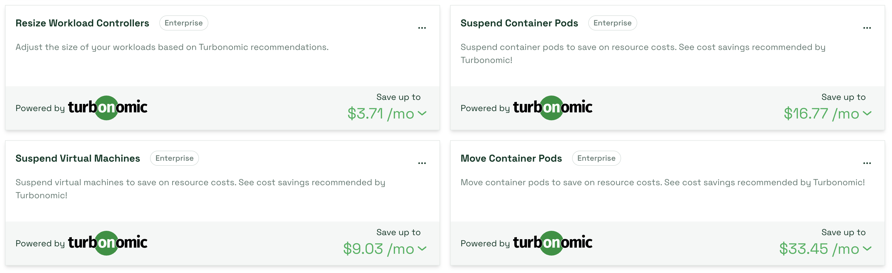
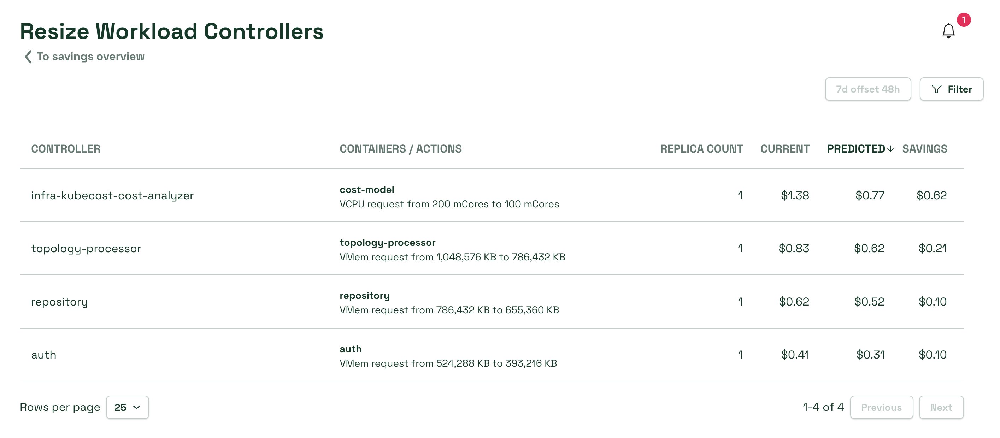
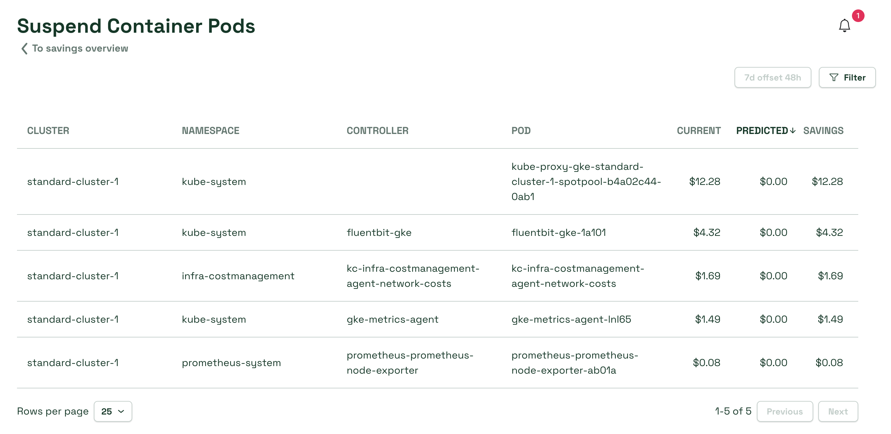
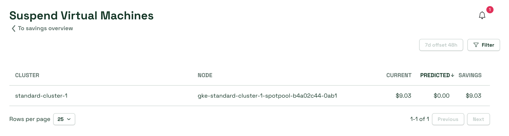
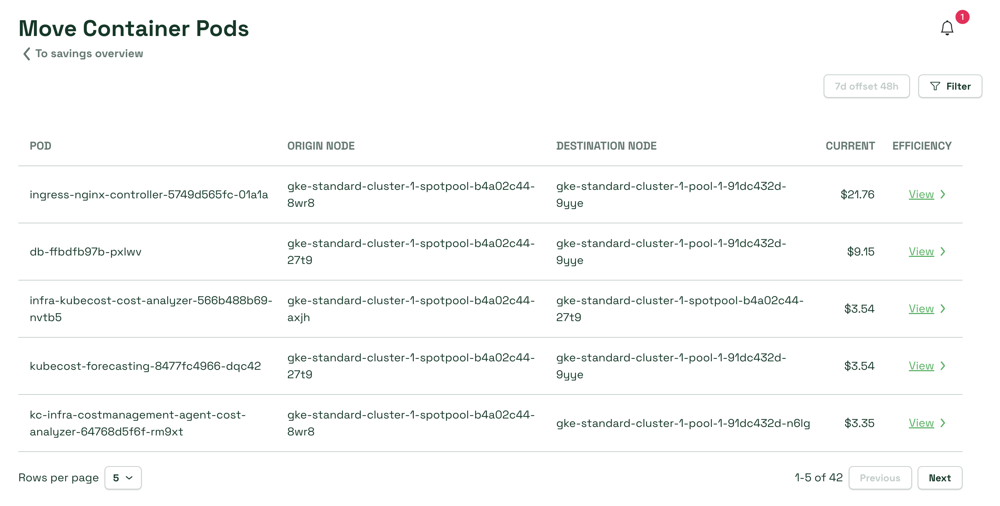

# Turbonomic Savings APIs 


This feature is in beta. Please read the documentation carefully.


The [IBM Turbonomic Action Center](https://www.ibm.com/docs/en/tarm/8.14.3?topic=reference-turbonomic-actions) offers multiple types of actions destined to improve the overall performance of your cluster(s). The integration between Kubecost and Turbonomic allows you to view the estimated savings incurred by executing these actions.

## Prerequisites
To use the Turbonomic Savings APIs, you must first enable the [Turbonomic Integration](../../integrations/turbonomic-integration.md). This is required for Kubecost to be able to pull action data from your Turbonomic client. 

## APIs
There exist several Kubecost Savings APIs, each of them being in direct correspondence to actions in the Turbonomic Action Center. 

### Resize Workload Controllers

This API provides the estimated cost impact of resizing the CPU and memory request(s) for every Container within a given workload, as recommended by Turbonomic.
The Current and Predicted cost columns are calculated using the [Spec Cost Prediction API](../governance-apis/spec-cost-prediction-api.md): the Current column is calculated by inferring the CPU and/or memory requests on all Containers in the workload, while the Predicted column is calculated by using the new request values recommended by Turbonomic for each container. Please note that at the moment, this functionality is only available for Deployments and StatefulSets. 

### Suspend Container Pods

This API provides the estimated cost impact of suspending a given Pod, as recommended by Turbonomic. 
The Current cost column represents the monthly rate for the Pod in question, queried over a period of `7d offset 48h` to account for reconciliation. 
The Predicted cost column is zero for suspension actions.

### Suspend Virtual Machines

This API provides the estimated cost impact of suspending a given Virtual Machine (Node), as recommended by Turbonomic.
The Current cost column represents the monthly rate for the node in question, queried over a period of `7d offset 48h` to account for reconciliation.
The Predicted cost column is zero for suspension actions.

### Move Container Pods

This API provides the estimated cost impact of moving a given Pod from a certain node (origin node) to another (destination node), as recommended by Turbonomic.
The Current cost column represents the monthly rate for the destination node, queried over a period of `7d offset 48h` to account for reconciliation.
The Efficiency column contains a hyperlink to the Efficiency page for the destination node, highlighting the infrastructure idle corresponding to it.  
