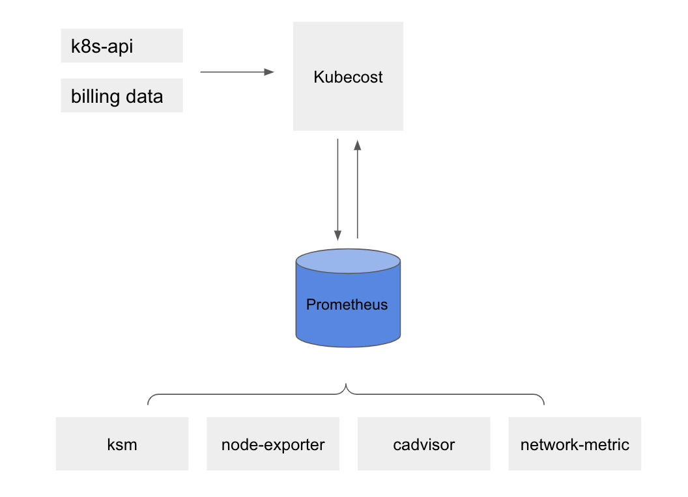
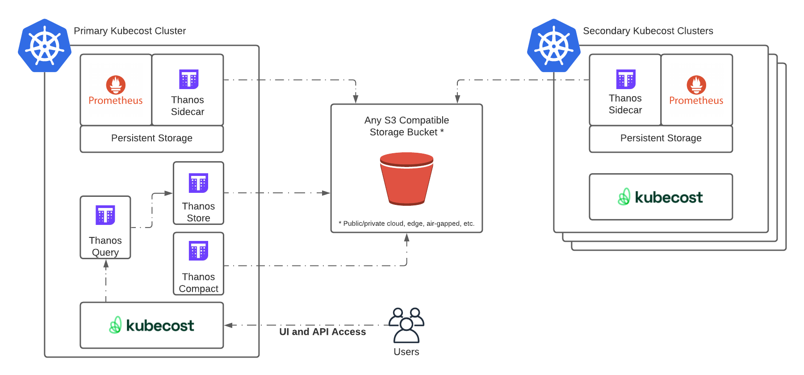

# Kubecost core architecture overview

Below are the major components deployed with the [Kubecost helm chart](http://docs.kubecost.com/install), excluding certain Enterprise components such a durable storage:

1. **Kubecost Cost-Analyzer Pod**  
    a. Frontend -- runs Nginx and handles routing to Kubecost backend + Prometheus/Grafana  
    b. Kubecost server -- backend for API calls  
    c. Cost-model -- provides cost allocation calculations and metrics, both reads and writes to Prometheus  
2. **Cost-Analyzer Checks Jobs** -- used for recurring product alerts & email updates [Deprecated in v1.79] 
3. **Prometheus**  
    a. Prometheus server -- time-series data store for cost & health metrics  
    b. Kube-state-metrics -- provides Kubernetes API metrics, e.g. resource requests  
    c. Node-exporter -- provides node-level utilization metrics for right-sizing recommendations and cluster utilization  [Optional]  
    d. Pushgateway -- provides ability for users to push new metrics to Prometheus [Optional]  
    e. Alertmanager -- used for custom alerts  [Optional] 
4. **Network costs** -- optional daemonset for collecting network metrics [learn more](https://github.com/kubecost/docs/blob/master/network-allocation.md)
5. **Grafana** -- provides supporting dashboards for Kubecost product 

Today, the core Kubecost product can be run with just components 1, 3a, and 3b.

See an overview of core components in this diagram:

# Enterprise architecture overview

The most common implementation of durable storage in the Kubecost application application is with [Thanos](https://thanos.io/). Below is a high-level reference for required components. More information on each Thanos component can be found [here](https://thanos.io/tip/components/).

