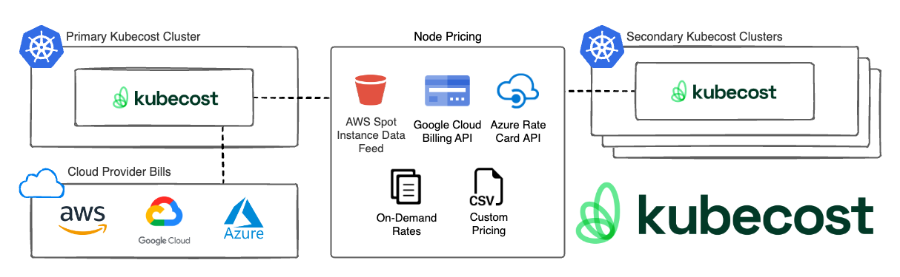

# Kubecost Pricing Sources

## Overview

There are multiple ways that Kubecost can be configured to pull in pricing data. This document outlines the different options and how to configure them.

## Pricing sources matrix


With the exception of integrated cloud service provider (CSP) billing, all pricing sources are configured per-cluster.


Kubecost supports the following pricing sources:

| Source | Detail | Pros | Cons | License |
|--|--|--|--|--|
| [Cloud provider on-demand API](#cloud-provider-on-demand-api) | On by default. Kubecost looks up public pricing APIs. | No configuration or maintenance. | For users with significant discounts, Kubecost costs will be significantly higher than actual billing. | Free |
| [Integrated CSP billing](/install-and-configure/install/cloud-integration/README.md) | Kubecost pulls CSP billing every 6 hours. When billing becomes available Kubecost reconciles the previously-estimated costs | Extremely accurate with little maintenance needed. All cloud billing can be imported. Out-of-cluster (OOC) costs can be [combined with Kubernetes resources](/using-kubecost/navigating-the-kubecost-ui/collections.md). | Kubecost requires access to the billing account. This setup can take time, especially if the team deploying Kubecost does not have access to the billing account. | Free |
| [Custom Pricing](#custom-pricing) | Manually set monthly costs for: CPU, RAM, storage, GPU, network, spot CPU, spot RAM | Simple configuration. Does not require CSP access. Works for on-prem clusters. Completely air-gapped for highly-secure environments  | Accuracy dependent on value provided. Single rate per resource- no flexibility per node/storage types. | Free |
| [Azure Rate Card](../install-and-configure/install/cloud-integration/azure-out-of-cluster/azure-config.md) | Kubecost pulls Azure Rate Card API. | More accurate Azure costs in the short-term (48 hours). | Limited value if billing-integration is configured. Requires additional setup with Azure. | Free |
| [Alibaba](../install-and-configure/install/provider-installations/alibaba-install.md) | Kubecost pulls Alibaba Rate Card API. | Currently the only method to retrieve Alibaba resource pricing. | More accurate costs. Requires additional setup with Alibaba. | Free |
| [AWS Spot Data Feed](/install-and-configure/install/cloud-integration/aws-cloud-integrations/aws-spot-instances.md) | Kubecost pulls spot prices from a custom feed. | More accurate costs in the short-term (48 hours) for Spot nodes.| Limited value if billing-integration is configured. Requires additional setup with AWS. | Free |
| [CSV Pricing](/install-and-configure/advanced-configuration/csv-pricing.md) | Reads a user-provided CSV to generate granular resource prices. | Does not require CSP access. Works for on-prem clusters. Completely air-gapped for highly-secure environments. | Mapping labels in the CSV can be tedious. | Enterprise |

## Diagram



## Cloud provider on-demand API

Kubecost will attempt to identify the provider of the cluster and pull pricing data from their public pricing APIs. Alibaba and Azure have their own specific pricing sources.

- [Alibaba](../install-and-configure/install/provider-installations/alibaba-install.md)
- [Azure Rate Card](../install-and-configure/install/cloud-integration/azure-out-of-cluster/azure-config.md)

### On-demand pricing references

The below files/resources are the onDemand prices used by Kubecost:

- [AWS EC2 pricing](https://pricing.us-east-1.amazonaws.com/offers/v1.0/aws/AmazonEC2/current/us-east-2/index.json)
- [Azure retail prices](https://learn.microsoft.com/en-us/rest/api/cost-management/retail-prices/azure-retail-prices)
- [GCP cloud billing for on-demand VMs](https://cloud.google.com/billing/docs/reference/rest/v1/services.skus/list)

## Cloud provider billing integration

See the following Kubecost documentation for assistance with configuring your cloud provider services:

- [Cloud Billing Integrations](/install-and-configure/install/cloud-integration/README.md)
  - [AWS Cost and Usage Report](/install-and-configure/install/cloud-integration/aws-cloud-integrations/aws-cloud-integrations.md)
  - [Azure Cost Export](/install-and-configure/install/cloud-integration/azure-out-of-cluster/azure-out-of-cluster.md)
  - [Google BigQuery Export](/install-and-configure/install/cloud-integration/gcp-out-of-cluster/README.md)

### Reconciliation

After Kubecost has ingested the initial billing data from your CSP, it will take approximately 36-48 hours to determine whether costs are accurately accounted as on-demand, and will account for any differences between standard retail pricing and actual spend. You can learn more about how reconciliation works in Kubecost's [Cloud Billing Integrations](/install-and-configure/install/cloud-integration/README.md) doc.

### Short-term cost estimation

After Kubecost has performed reconciliation, it can further deduct accurate node pricing through short-term cost estimation, in which Kubecost uses historical spend data to determine daily and hourly node costs. Learn more in Kubecost's [Cloud Billing Integrations](/install-and-configure/install/cloud-integration/README.md) doc.

## Custom pricing

For users with air-gapped environments, custom pricing values can be configured for CPU, GPU, and RAM, with spot pricing distinctions. Set the following Helm values via your *values-kubecost.yaml*, or in the Kubecost UI by going to *Settings*, then under 'Pricing', toggling on 'Enable Custom Pricing', then making adjustments per group:


Prices are monthly. `storage` and miscellaneous network metrics are all per GB.

```yaml
kubecostProductConfigs:
  customPricesEnabled: true
  defaultModelPricing:
    enabled: true
    CPU: 28.0 # Single core per month cost
    spotCPU: 4.86 # Single core per month cost
    RAM: 3.09 # GB per month cost
    spotRAM: 0.65 # GB per month cost
    GPU: 693.50 # per month cost
    spotGPU: 225.0 # per month cost
    storage: 0.04 # per GB per month cost
    zoneNetworkEgress: 0.01 # per GB per month cost
    regionNetworkEgress: 0.01 # per GB per month cost
    internetNetworkEgress: 0.12 # per GB per month cost
```

For advanced customization of individual resources, see [CSV pricing](/install-and-configure/advanced-configuration/csv-pricing.md).
