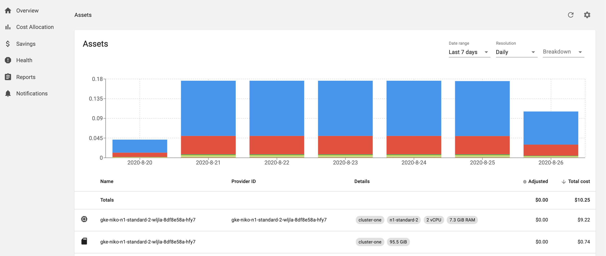

The Kubecost Assets view shows Kubernetes cluster costs broken down by the individual backing assets in your cluster (e.g. cost by node, disk, and other assets). 
It’s used to identify spend drivers over time and to audit Allocation data. This view can also optionally show out of cluster assets by service, tag/label, etc.

> Note: Similar to our Allocation API, the Assets API uses our ETL pipeline whichs aggregates data on a daily basis. This allows for enterprise scale with much higher performance. 



This user interface is available at `<your-kubecost-address>/assets.html`.

# Assets API

The assets API retrieves backing cost data broken down by individual assets in your cluster but also provides various aggregations of this data.

The API is available at the following endpoint:

```
http://<your-kubecost-address>/model/assets
```

Here are example uses:

* http://localhost:9090/model/assets?window=today
* http://localhost:9090/model/assets?window=7d
* http://localhost:9090/model/assets?window=7d&aggregate=type
* http://localhost:9090/model/assets?window=7d&aggregate=type&accumulate=true

API parameters include the following:

* `window` dictates the applicable window for measuring historical asset cost. Currently supported options are as follows:
    - "15m", "24h", "7d", "48h", etc. 
    - "today", "yesterday", "week", "month", "lastweek", "lastmonth"
    - "1586822400,1586908800", etc. (start and end unix timestamps)
    - "2020-04-01T00:00:00Z,2020-04-03T00:00:00Z", etc. (start and end UTC RFC3339 pairs)
* `aggregate` is used to consolidate cost model data. Supported aggregation types are cluster and type. Passing an empty value for this parameter, or not passing one at all, returns data by individual asset.
* `accumulate` when set to false this endpoint returns daily time series data vs cumulative data. Default value is false.
* `disableAdjustments` when set to true, zeros out all adjustments from cloud provider reconciliation, which would otherwise change the totalCost.

This API returns a set of JSON objects in this format:

```
  {
    cluster: "cluster-one"  // parent cluster for asset
    cpuCores: 2  // number of CPUs, given this is a node asset type
    cpuCost: 0.047416 // cumulative cost of CPU measured over time window
    discount: 0.3 // discount applied to asset cost
    end: "2020-08-21T00:00:00+0000" // end of measured time window
    gpuCost: 0
    key: "cluster-one/node/gke-niko-n1-standard-2-wljla-8df8e58a-hfy7"
    name: "gke-niko-n1-standard-2-wljla-8df8e58a-hfy7"
    nodeType: "n1-standard-2"
    preemptible: 0
    providerID: "gke-niko-n1-standard-2-wljla-8df8e58a-hfy7"
    ramBytes: 7840256000
    ramCost: 0.023203
    start: "2020-08-20T00:00:00+0000"
    adjustment: 0.0023 // amount added to totalCost during reconciliation with cloud provider data
    totalCost: 0.049434 // total asset cost after applied discount 
    type: "node" // e.g. node, disk, cluster management fee, etc
}
```

Optional filter parameters take the format of `&<filter>=<value>` appended to the assets URL query and include the following:
Filter | Description
--------- | -----------
`filterAccounts` | Filter results by Cloud account. *Requires cloud configuration.*
`filterCategories` | Filter results by asset category. Examples include `Network`, `Management`, `Compute`, `Storage`, or `Other`.
`filterClusters` | Filter results by cluster ID. Note: cluster ID is generated from `cluster_id` provided during installation.
`filterLabels` | Filter results by cloud label or cloud tag. For example, appending `&labels=deployment:kubecost-cost-analyzer` only returns assets with label `deployment=kubecost-cost-analyzer`. CSV list of label values supported. Note that subparameter `:` symbols are required to denote `<labelKey>:<labelValue>` pairs.
`filterNames` | Filter results by asset name.
`filterProjects` | Filter results by cloud project ID. *Requires cloud configuration.*
`filterProviders` | Filter results by provider. For example, appending `&filterProviders=GCP` only returns assets belonging to provider `GCP`. *Requires cloud configuration.*
`filterProviderIDs` | Filter results by provider ID individual to each cloud asset. For examples, go to the Assets page, select Breakdown by Item, and see the Provider ID column. *Requires cloud configuration.*
`filterServices` | Filter results by service. Examples include `Cloud Storage`, `Kubernetes`, `BigQuery`.
`filterTypes` | Filter results by asset type. Examples include `Cloud`, `ClusterManagement`, `Node`, `LoadBalancer`, and `Disk`.

Note:
 - Some filters require cloud configuration, which can be set at `<your-kubecost-address>/keyinstructions.html`
 - Multiple filter selections evaluate as ANDs. Each filter selection accepts comma-separated values that evaluate as ORs.
    - For example, including both `filterClusters=cluster-one` and `filterNames=name1,name2` logically evaluates as `(cluster == cluster-one) && (name == name1 || name == name2)`
 - All filters are case-sensitive except for `filterTypes`
 - All filters accept wildcard filters denoted by a URL-encoded `*` suffix, except for `filterTypes` and the label key in `filterLabels`
    - For example, `filterProviderIDs=gke%2A` will return all assets with a `gke` string prefix in its Provider ID.
    - For example, `filterLabels=deployment%3Dkube%2A` will return all assets with `deployment` label value containing a `kube` prefix.
 - Invalid filters return no assets.


# Cloud cost reconciliation

After granting Kubecost permission to access cloud billing data, Kubecost adjusts its asset prices once cloud billing data becomes available, e.g. AWS Cost and Usage Report and the spot data feed. Until this data is available from cloud provider, Kubecost uses data from public cloud APIs to determine cost, or alternatively custom pricing sheets. This allows teams to have highly accurate estimates of asset prices in real-time and then become even more precise once cloud billing data becomes available, which is often 1-2 hours for spot nodes and up to a day for reserved instances/savings plans. 

Note that while cloud adjustments typically lag by roughly a day, there are certain adjustments, e.g. credits, that may continue to come in over the course of the month, and in some cases at the very end of the month, so reconciliation adjustments may continue to update over time.

