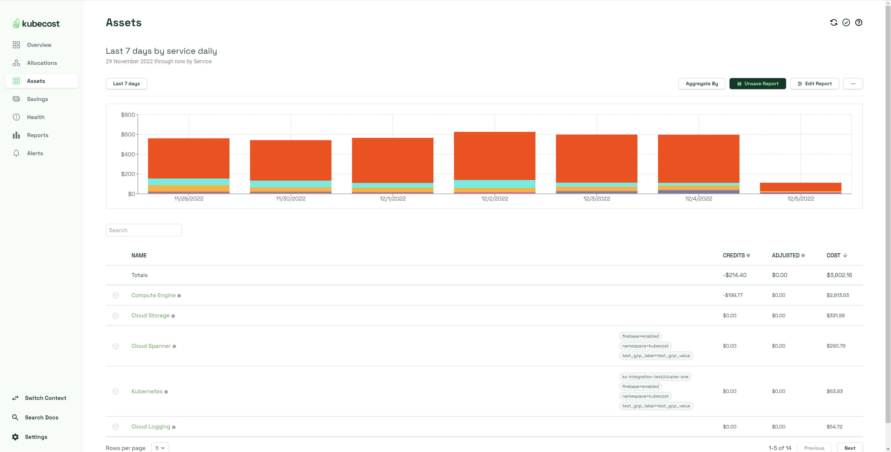
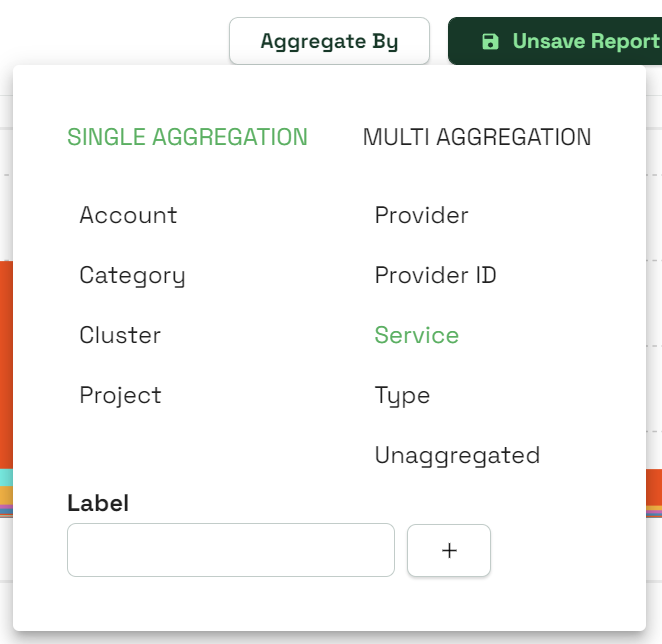
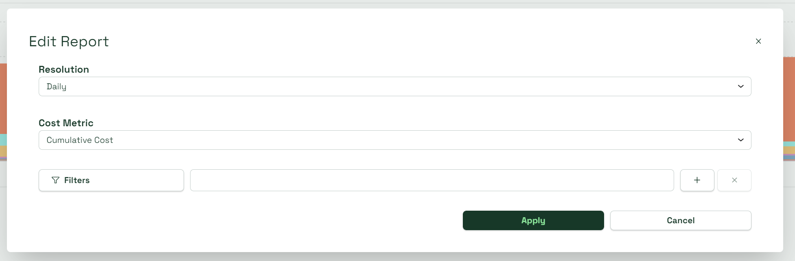

# Assets Dashboard


As of v1.104, cloud data is parsed through the [Cloud Costs Explorer](https://docs.kubecost.com/using-kubecost/navigating-the-kubecost-ui/cloud-costs-explorer) dashboard instead of through Assets. Read our announcement [here](https://blog.kubecost.com/blog/cloud-cost-install/) for more information.


The Kubecost Assets dashboard shows Kubernetes cluster costs broken down by the individual backing assets in your cluster (e.g. cost by node, disk, and other assets). It’s used to identify spend drivers over time and to audit Allocation data. This view can also optionally show out-of-cluster assets by service, tag/label, etc.


Similar to our Allocation API, the Assets API uses our ETL pipeline which aggregates data daily. This allows for enterprise-scale with much higher performance.


<figure><figcaption>
Assets page
</figcaption></figure>

## Configuring your query

Kubecost provides a variety of options for configuring your assets queries to view the information you need. Below is a table of the major configuration options, with in-depth explanations in this article for how they work.

| Element                  | Description                                                                                                         |
| ------------------------ | ------------------------------------------------------------------------------------------------------------------- |
| Date Range (Last 7 days) | Will report _Last 7 days_ by default. Manually select your start and end date, or pick one of twelve preset options |
| Aggregate By             | Aggregate costs by one or several concepts. Add custom labels                                                       |
| Save/Unsave              | Save or unsave the current report                                                                                   |
| Edit                     | Adjust cost metrics and how data is displayed                                                                       |
| Additional options icon  | Additional options for opening and downloading reports                                                              |

### Date Range

Select the date range of the report by setting specific start and end dates, or using one of the preset options.

### Aggregate By filter

<figure><figcaption>
Aggregate By window
</figcaption></figure>

Here you can aggregate cost by native Kubernetes concepts. While selecting Single Aggregation, you will only be able to select one concept at a time. While selecting Multi Aggregation, you will be able to filter for multiple concepts at the same time. Assets will be by default aggregated by Service.

### Edit Report

<figure><figcaption>
Edit Report window
</figcaption></figure>

The Edit icon has additional options to filter your search:

#### Resolution

Change the display of your recent assets by service. _Daily_ provides a day-by-day breakdown of assets. _Entire window_ creates a semicircle that shows each asset as a sizable portion based on total cost within the displayed time frame.

#### Cost metric

View either cumulative or run rate costs measured over the selected time window based on the assets being filtered for.

* Cumulative Cost: represents the actual/historical spend captured by the Kubecost agent over the selected time window
* Rate metrics: Monthly, daily, or hourly “run rate” cost, also used for projected cost figures, based on samples in the selected time window

#### Filters

Filter assets by category, service, or other means. When a filter is applied, only resources with this matching value will be shown.

### Additional options

The three horizontal dots icon will provide additional options for handling your reports:

* Open Report: Open one of your saved reports
* Download CSV: Download your current report as a CSV file

## Assets metrics table

The assets metrics table displays your aggregate assets, with four columns to organize by.

* Name: Name of the aggregate group
* Credits: Amount deducted from total cost due to provider-applied credit. A negative number means the total cost was reduced.
* Adjusted: Amount added to total cost based on reconciliation with cloud provider’s billing data.
* Total cost: Shows the total cost of the aggregate asset factoring in additions or subtractions from the Credits and Adjusted columns.

Hovering over the gray info icon next to each asset will provide you with the hours run and hourly cost of the asset. To the left of each asset name is one of several Category icons (you can aggregate by these): Storage, Network, Compute, Management, and Other.

Gray bubble text may appear next to an asset. These are all manually-assigned labels to an asset. To filter assets for a particular label, select the _Edit search parameters_ icon, then select _Label/Tag_ from the Filters dropdown and enter the complete name of the label.

You can select an aggregate asset to view all individual assets comprising it. Each individual asset should have a ProviderID.

## Cloud cost reconciliation

After granting Kubecost permission to access cloud billing data, Kubecost adjusts its asset prices once cloud billing data becomes available, e.g. AWS Cost and Usage Report and the spot data feed. Until this data is available from cloud providers, Kubecost uses data from public cloud APIs to determine cost, or alternatively custom pricing sheets. This allows teams to have highly accurate estimates of asset prices in real-time and then become even more precise once cloud billing data becomes available, which is often 1-2 hours for spot nodes and up to a day for reserved instances/savings plans.

While cloud adjustments typically lag by roughly a day, there are certain adjustments, e.g. credits, that may continue to come in over the course of the month, and in some cases at the very end of the month, so reconciliation adjustments may continue to update over time.
