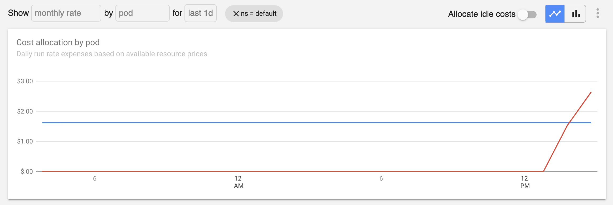

Auditing the cost of workloads can be complex in dynamic Kubernetes environments. For this reason, this resource provides an overview on two approaches for inspecting the underlying inputs to cost Allocation metrics. 

## Audit tool

Visit the `/audit` page on the Kubecost frontend to review inputs to cpu, memory, storage, and node-level costs calculations on the Allocation view. This tool displays cost input data by *container* and compares the product of these metrics to the aggregatedCostModel API which is the backing API for the Allocation view. The default time window measured is 1 day. Note that idle and shared costs are not included as part of this view. 

If differences are found between the independant inputs and the model itself, select the container name to view its associated Grafana dashboard. This will allow the verification of A) the time this container was running and B) amount of resource allocated [learn more](https://github.com/kubecost/cost-model/blob/develop/README.md#how-do-you-allocate-a-specific-amount-of-ramcpu-to-an-individual-pod-or-container). Viewing node costs at the bottom of this page will enable the verificaion of C) cost of allocated resources. 

Differences between these independant inputs and the cost model are expected to arise if the `cost-model` /metrics endpoint has not been consistently scraped over the measured time window. Other unexpected differences can be reported to <team@kubecost.com>

## Manual spot check
We've created this guide to help you spot check cost metrics directly in Prometheus and ensure they are calculated as expected.

1. **Identify a pod or namespace to audit.** In this example, we will audit the `default` namespace.  
2. **Open Prometheus console.** We recommend going directly to the underlying data in Prometheus for a manual audit. Complete the following steps to view the console for our bundled Prometheus:  

    * Execute `kubectl port-forward --namespace kubecost service/kubecost-prometheus-server 9003:80`
    * Point your browser to <http://localhost:9003>

3. **Verify raw allocation metrics.** Run the following queries and then visit the Prometheus graph tab. Note that allocations are the max of resource requests and usage. Ensure these values are consistent with Kubernetes API and/or cAdvisor metrics. Using a Grafana dashboard or Prometheus console graph can be a useful way to view underlying request and usage metrics.  

    * `container_cpu_allocation{namespace="default"}`
    * `container_memory_allocation_bytes{namespace="default"}`

4. **Verify monthly node prices.** Ensure these are consistent with bills from cloud provider or from advertised rates:  

    * `node_cpu_hourly_cost * 730`
    * `node_ram_hourly_cost * 730`
    * `node_total_hourly_cost * 730`
    * `kube_node_status_capacity_cpu_cores * on(node) group_left() node_cpu_hourly_cost * 730 + kube_node_status_capacity_memory_bytes * on(node) group_left() node_ram_hourly_cost * 730 / 1024 / 1024 / 1024`

    **Note:** Prometheus values do not account for sustained use, custom prices, or other discounts applied in Settings.  

5. **Calculate total resource costs.** Multiply the previously audited allocation by the previously audited price.  

    * `container_cpu_allocation{namespace="default"} * on(instance) group_left() node_cpu_hourly_cost * 730`
    * `container_memory_allocation_bytes{namespace="default"} / 1024 / 1024 / 1024  * on(instance) group_left() node_ram_hourly_cost * 730`

6. **Confirm consistency with monthly Allocation view.** Visit the Allocation tab in the Kubecost product. Filter by `default ` namespace. Select `monthly run rate` by `pod` then view the time series chart to confirm the values in the previous step are consistent.  

**Reminder:** Don't forget to apply any sustained use or other discounts during a manual spot check.
