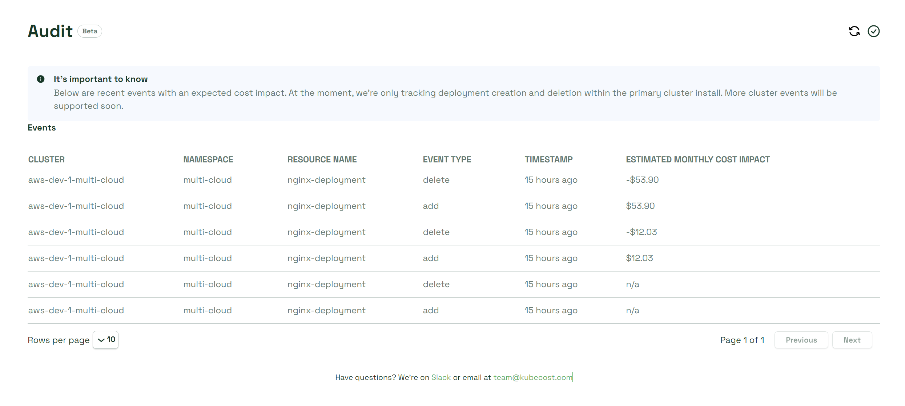

# Audits

**Warning**: The Audits dashboard cannot be used until you have enabled the Cost Events Audit API via Helm. See the doc on the Cost Events Audit API [here](https://docs.kubecost.com/apis/apis-overview/cost-events-audit-api#enabling-the-cost-events-audit-api) for instructions.

The Audit dashboard provides a log of changes made to your deployment. It's powered by the [Audit Events Cost API](https://docs.kubecost.com/apis/apis-overview/cost-events-audit-api) and the [Predict API](https://docs.kubecost.com/apis/apis-overview/spec-cost-prediction-api). Supported event types include additions and deletions.

<figure><figcaption>
Audit dashboard
</figcaption></figure>

## Estimated monthly cost impact

Cost impact from additions or deletions is provided using the Predict API. Deletions should naturally result in cost savings, indicated by a negative value, with the opposite effect for additions.
