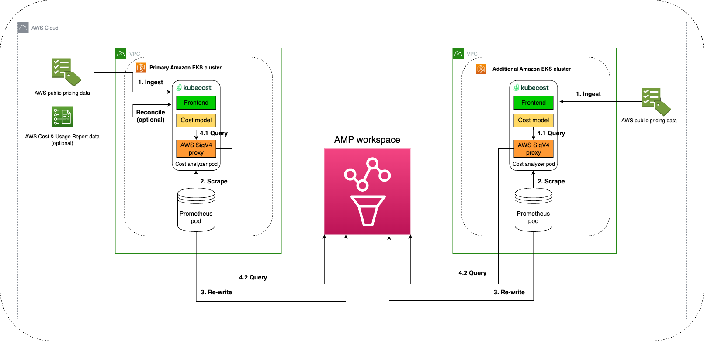
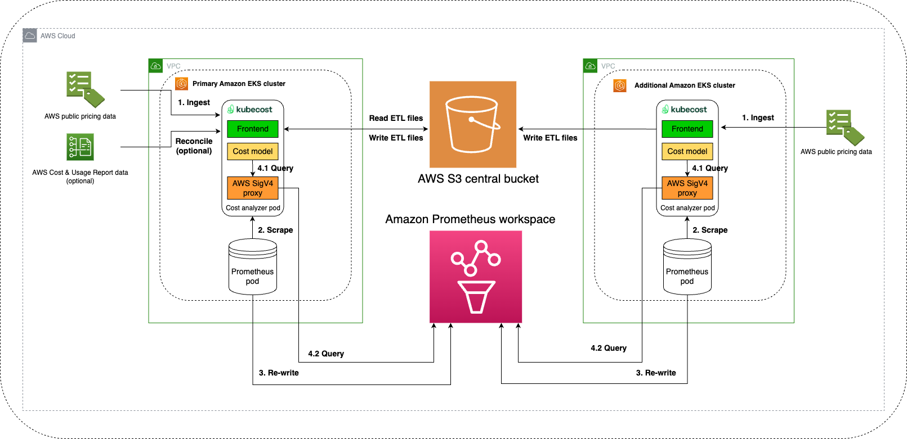

# Amazon Managed Service for Prometheus

## Overview

Kubecost leverages the open-source Prometheus project as a time series database and post-processes the data in Prometheus to perform cost allocation calculations and provide optimization insights for your Kubernetes clusters such as Amazon Elastic Kubernetes Service (Amazon EKS). Prometheus is a single machine statically-resourced container, so depending on your cluster size or when your cluster scales out, it could exceed the scraping capabilities of a single Prometheus server. In collaboration with Amazon Web Services (AWS), Kubecost integrates with [Amazon Managed Service for Prometheus (AMP)](https://docs.aws.amazon.com/prometheus/index.html), a managed Prometheus-compatible monitoring service, to enable the customer to easily monitor Kubernetes cost at scale.

## Reference resources

* [Amazon Managed Prometheus (AMP)](https://docs.aws.amazon.com/prometheus/latest/userguide/what-is-Amazon-Managed-Service-Prometheus.html)
* [AMP IAM permissions and policies](https://docs.aws.amazon.com/prometheus/latest/userguide/AMP-and-IAM.html)

## Architecture
The architecture of this integration is similar to Amazon EKS cost monitoring with Kubecost, which is described in [the previous blog post](https://aws.amazon.com/blogs/containers/aws-and-kubecost-collaborate-to-deliver-cost-monitoring-for-eks-customers/), with some enhancements as follows:

In this integration, an additional AWS SigV4 container is added to the cost-analyzer pod, acting as a proxy to help query metrics from Amazon Managed Service for Prometheus using the AWS SigV4 signing process. It enables passwordless authentication to reduce the risk of exposing your AWS credentials.

When the Amazon Managed Service for Prometheus integration is enabled, the bundled Prometheus server in the Kubecost Helm Chart is configured in the remote_write mode. The bundled Prometheus server sends the collected metrics to Amazon Managed Service for Prometheus using the AWS SigV4 signing process. All metrics and data are stored in Amazon Managed Service for Prometheus, and Kubecost queries the metrics directly from Amazon Managed Service for Prometheus instead of the bundled Prometheus. It helps customers not worry about maintaining and scaling the local Prometheus instance.

There are two architectures you can deploy: 
1. The Quick-Start architecture supports a small multi-cluster setup.
2. The Federated architecture supports a large multi-cluster setup.

### Quick-Start architecture
The small-scale infrastructure can manage a small multi-cluster setup. The following architecture diagram illustrates the small-scale infrastructure setup:



### Federated architecture
To support a large-scale environment, Kubecost leverages a [Federated ETL architecture](./federated-etl.md). In addition to Amazon Prometheus Workspace, Kubecost stores its extract, transform, and load (ETL) data in a central S3 bucket. Kubecost's ETL data is a computed cache based on Prometheus's metrics, from which users can perform all possible Kubecost queries. By storing the ETL data on an S3 bucket, this integration offers resiliency to your cost allocation data, improves the performance and enables high availability architecture for your Kubecost setup. 

The following architecture diagram illustrates the large-scale infrastructure setup:



## Instructions
### Prerequisites
You have an existing AWS account.
You have IAM credentials to create Amazon Managed Service for Prometheus and IAM roles programmatically.
You have an existing [Amazon EKS cluster with OIDC enabled.](https://docs.aws.amazon.com/eks/latest/userguide/enable-iam-roles-for-service-accounts.html)
Your Amazon EKS clusters have [Amazon EBS CSI](https://docs.aws.amazon.com/eks/latest/userguide/ebs-csi.html) driver installed
### Create Amazon Managed Service for Prometheus workspace:

#### Step 1: Run the following command to get the information of your current EKS cluster:

```bash
kubectl config current-context
```
The example output should be in this format:

```bash
arn:aws:eks:${AWS_REGION}:${YOUR_AWS_ACCOUNT_ID}:cluster/${YOUR_CLUSTER_NAME}
```

#### Step 2: Run the following command to create new a Amazon Managed Service for Prometheus workspace

```bash
export AWS_REGION=<YOUR_AWS_REGION>
aws amp create-workspace --alias kubecost-amp --region $AWS_REGION
```

The Amazon Managed Service for Prometheus workspace should be created in a few seconds. Run the following command to get the workspace ID:

```bash
export AMP_WORKSPACE_ID=$(aws amp list-workspaces --region ${AWS_REGION} --output json --query 'workspaces[?alias==`kubecost-amp`].workspaceId | [0]' | cut -d'"' -f 2)
echo $AMP_WORKSPACE_ID
```
### Setting up the environment:
#### Step 1: Set environment variables for integrating Kubecost with Amazon Managed Service for Prometheus

Run the following command to set environment variables for integrating Kubecost with Amazon Managed Service for Prometheus:

```bash
export RELEASE="kubecost"
export YOUR_CLUSTER_NAME=<YOUR_EKS_CLUSTER_NAME>
export AWS_REGION=${AWS_REGION}
export VERSION="1.103.4"
export KC_BUCKET="kubecost-etl-metrics" # Remove this line if you want to set up small-scale infrastructure 
export AWS_ACCOUNT_ID=$(aws sts get-caller-identity --query Account --output text)
export REMOTEWRITEURL="https://aps-workspaces.${AWS_REGION}.amazonaws.com/workspaces/${AMP_WORKSPACE_ID}/api/v1/remote_write"
export QUERYURL="http://localhost:8005/workspaces/${AMP_WORKSPACE_ID}"
```
#### Step 2: Set up S3 bucket, IAM policy and Kubernetes secret for storing Kubecost ETL files

>Note: You can ignore this step 2 for the small-scale infrastructure setup

**a. Create Object store S3 bucket to store Kubecost ETL metrics:**

Run the following command in your workspace:

```bash 
aws s3 mb s3://${KC_BUCKET}
```
**b. Create IAM Policy to grant access to the S3 bucket.** 
The following policy is for demo purposes only. You may need to consult your security team and make appropriate changes depending on your organization's requirements.

Run the following command in your workspace:

```bash
# create policy-kubecost-aws-s3.json file
cat <<EOF>policy-kubecost-aws-s3.json
{
    "Version": "2012-10-17",
    "Statement": [
        {
            "Sid": "VisualEditor0",
            "Effect": "Allow",
            "Action": [
                "s3:ListBucket",
                "s3:GetBucketLocation"
            ],
            "Resource": "arn:aws:s3:::${KC_BUCKET}"
        },
        {
            "Sid": "VisualEditor1",
            "Effect": "Allow",
            "Action": [
                "s3:PutObject",
                "s3:GetObject",
                "s3:ListBucketMultipartUploads",
                "s3:AbortMultipartUpload",
                "s3:ListBucket",
                "s3:DeleteObject",
                "s3:ListMultipartUploadParts"
            ],
            "Resource": [
                "arn:aws:s3:::${KC_BUCKET}",
                "arn:aws:s3:::${KC_BUCKET}/*"
            ]
        }
    ]
}
EOF
# create the AWS IAM policy
aws iam create-policy \
 --policy-name kubecost-s3-federated-policy-$YOUR_CLUSTER_NAME \
 --policy-document file://policy-kubecost-aws-s3.json
```

**c. Create Kubernetes secret to allow Kubecost to write ETL files to the S3 bucket.**

Run the following command in your workspace:

```bash
# create manifest file for the secret
cat <<EOF>federated-store.yaml
type: S3
config:
  bucket: "${KC_BUCKET}"
  endpoint: "s3.amazonaws.com"
  region: "${AWS_REGION}"
  insecure: false
  signature_version2: false
  put_user_metadata:
      "X-Amz-Acl": "bucket-owner-full-control"
  http_config:
    idle_conn_timeout: 90s
    response_header_timeout: 2m
    insecure_skip_verify: false
  trace:
    enable: true
  part_size: 134217728
EOF
# create Kubecost namespace and the secret from the manifest file 
kubectl create namespace ${RELEASE}
kubectl create secret generic \
  kubecost-object-store -n ${RELEASE} \
  --from-file federated-store.yaml
```

#### Step 3: Set up IRSA to allow Kubecost and Prometheus to read & write metrics from Amazon Managed Service for Prometheus

These following commands help to automate the following tasks:
- Create an IAM role with the AWS managed IAM policy and trusted policy for the following service accounts: `kubecost-cost-analyzer-amp`, `kubecost-prometheus-server-amp`.
- Modify current K8s service accounts with annotation to attach a new IAM role.

Run the following command in your workspace:

```bash
eksctl create iamserviceaccount \
    --name kubecost-cost-analyzer-amp \
    --namespace ${RELEASE} \
    --cluster ${YOUR_CLUSTER_NAME} --region ${AWS_REGION} \
    --attach-policy-arn arn:aws:iam::aws:policy/AmazonPrometheusQueryAccess \
    --attach-policy-arn arn:aws:iam::aws:policy/AmazonPrometheusRemoteWriteAccess \
   --attach-policy-arn arn:aws:iam::${AWS_ACCOUNT_ID}:policy/kubecost-s3-federated-policy-${YOUR_CLUSTER_NAME} \ # Remove this line if you want to set up small-scale infrastructure 
    --override-existing-serviceaccounts \
    --approve
```

```bash
eksctl create iamserviceaccount \
    --name kubecost-prometheus-server-amp \
    --namespace ${RELEASE} \
    --cluster ${YOUR_CLUSTER_NAME} --region ${AWS_REGION} \
    --attach-policy-arn arn:aws:iam::aws:policy/AmazonPrometheusQueryAccess \
    --attach-policy-arn arn:aws:iam::aws:policy/AmazonPrometheusRemoteWriteAccess \
    --override-existing-serviceaccounts \
    --approve
```

For more information, you can check AWS documentation at [IAM roles for service accounts](https://docs.aws.amazon.com/eks/latest/userguide/iam-roles-for-service-accounts.html) and learn more about Amazon Managed Service for Prometheus managed policy at [Identity-based policy examples for Amazon Managed Service for Prometheus](https://docs.aws.amazon.com/prometheus/latest/userguide/security_iam_id-based-policy-examples.html)

## Integrating Kubecost with Amazon Managed Service for Prometheus
### Prepare the configuration file

Run the following command to create a file called config-values.yaml, which contains the defaults that Kubecost will use for connecting to your Amazon Managed Service for Prometheus workspace.

```bash
cat << EOF > config-values.yaml
global:
  amp:
    enabled: true
    prometheusServerEndpoint: http://localhost:8005/workspaces/${AMP_WORKSPACE_ID}
    remoteWriteService: https://aps-workspaces.${AWS_REGION}.amazonaws.com/workspaces/${AMP_WORKSPACE_ID}/api/v1/remote_write
    sigv4:
      region: ${AWS_REGION}

sigV4Proxy:
  region: ${AWS_REGION}
  host: aps-workspaces.${AWS_REGION}.amazonaws.com
EOF
```
### Primary cluster

Run this command to install Kubecost and integrate it with the Amazon Managed Service for Prometheus workspace as the primary

```bash
helm upgrade -i ${RELEASE} \
oci://public.ecr.aws/kubecost/cost-analyzer --version $VERSION \
--namespace ${RELEASE} --create-namespace \
-f https://tinyurl.com/kubecost-amazon-eks \
-f config-values.yaml \
-f https://raw.githubusercontent.com/kubecost/poc-common-configurations/main/etl-federation/primary-federator.yaml \ # Remove this line if you want to set up small-scale infrastructure 
--set global.amp.prometheusServerEndpoint=${QUERYURL} \
--set global.amp.remoteWriteService=${REMOTEWRITEURL} \
--set kubecostProductConfigs.clusterName=${YOUR_CLUSTER_NAME} \
--set kubecostProductConfigs.projectID=${AWS_ACCOUNT_ID} \
--set prometheus.server.global.external_labels.cluster_id=${YOUR_CLUSTER_NAME} \
--set federatedETL.federator.primaryClusterID=${YOUR_CLUSTER_NAME} \ # Remove this line if you want to set up small-scale infrastructure 
--set serviceAccount.create=false \
--set prometheus.serviceAccounts.server.create=false \
--set serviceAccount.name=kubecost-cost-analyzer-amp \
--set prometheus.serviceAccounts.server.name=kubecost-prometheus-server-amp
```
### Additional clusters

The installation steps are similar to PRIMARY CLUSTER except you do not need to follow the steps in the section Create Amazon Managed Service for Prometheus workspace, and you need to update these environment variables below to match with your ADDITIONAL CLUSTERS. Please note that the AMP_WORKSPACE_ID and KC_BUCKET are the same as the Primary cluster

```bash
export RELEASE="kubecost"
export YOUR_CLUSTER_NAME=<YOUR_EKS_CLUSTER_NAME>
export AWS_REGION="<YOUR_AWS_REGION>"
export VERSION="1.103.4"
export KC_BUCKET="kubecost-etl-metrics"
export AWS_ACCOUNT_ID=$(aws sts get-caller-identity --query Account --output text)
export REMOTEWRITEURL="https://aps-workspaces.${AWS_REGION}.amazonaws.com/workspaces/${AMP_WORKSPACE_ID}/api/v1/remote_write"
export QUERYURL="http://localhost:8005/workspaces/${AMP_WORKSPACE_ID}"
```
Run this command to install Kubecost and integrate it with the Amazon Managed Service for Prometheus workspace as  the additional cluster:

```bash
helm upgrade -i ${RELEASE} \
oci://public.ecr.aws/kubecost/cost-analyzer --version $VERSION \
--namespace ${RELEASE}  --create-namespace \
-f https://tinyurl.com/kubecost-amazon-eks \
-f config-values.yaml \
-f https://raw.githubusercontent.com/kubecost/poc-common-configurations/main/etl-federation/agent-federated.yaml \ # Remove this line if you want to set up small-scale infrastructure 
--set global.amp.prometheusServerEndpoint=${QUERYURL} \
--set global.amp.remoteWriteService=${REMOTEWRITEURL} \
--set kubecostProductConfigs.clusterName=${YOUR_CLUSTER_NAME} \
--set kubecostProductConfigs.projectID=${AWS_ACCOUNT_ID} \
--set prometheus.server.global.external_labels.cluster_id=${YOUR_CLUSTER_NAME} \
--set serviceAccount.create=false \
--set prometheus.serviceAccounts.server.create=false \
--set serviceAccount.name=kubecost-cost-analyzer-amp \
--set prometheus.serviceAccounts.server.name=kubecost-prometheus-server-amp
```

Your Kubecost setup is now writing and collecting data from AMP. Data should be ready for viewing within 15 minutes.

To verify that the integration is set up, go to _Settings_ in the Kubecost UI, and check the Prometheus Status section.


Read our [Custom Prometheus integration troubleshooting guide](custom-prom.md#troubleshooting) if you run into any errors while setting up the integration. For support from AWS, you can submit a support request through your existing [AWS support contract](https://aws.amazon.com/contact-us/).

## Add recording rules (optional)

You can add these recording rules to improve the performance. Recording rules allow you to precompute frequently needed or computationally expensive expressions and save their results as a new set of time series. Querying the precomputed result is often much faster than running the original expression every time it is needed. Follow [these instructions](https://docs.aws.amazon.com/prometheus/latest/userguide/AMP-Ruler.html) to add the following rules:

```yaml
    groups:
      - name: CPU
        rules:
          - expr: sum(rate(container_cpu_usage_seconds_total{container_name!=""}[5m]))
            record: cluster:cpu_usage:rate5m
          - expr: rate(container_cpu_usage_seconds_total{container_name!=""}[5m])
            record: cluster:cpu_usage_nosum:rate5m
          - expr: avg(irate(container_cpu_usage_seconds_total{container_name!="POD", container_name!=""}[5m])) by (container_name,pod_name,namespace)
            record: kubecost_container_cpu_usage_irate
          - expr: sum(container_memory_working_set_bytes{container_name!="POD",container_name!=""}) by (container_name,pod_name,namespace)
            record: kubecost_container_memory_working_set_bytes
          - expr: sum(container_memory_working_set_bytes{container_name!="POD",container_name!=""})
            record: kubecost_cluster_memory_working_set_bytes
      - name: Savings
        rules:
          - expr: sum(avg(kube_pod_owner{owner_kind!="DaemonSet"}) by (pod) * sum(container_cpu_allocation) by (pod))
            record: kubecost_savings_cpu_allocation
            labels:
              daemonset: "false"
          - expr: sum(avg(kube_pod_owner{owner_kind="DaemonSet"}) by (pod) * sum(container_cpu_allocation) by (pod)) / sum(kube_node_info)
            record: kubecost_savings_cpu_allocation
            labels:
              daemonset: "true"
          - expr: sum(avg(kube_pod_owner{owner_kind!="DaemonSet"}) by (pod) * sum(container_memory_allocation_bytes) by (pod))
            record: kubecost_savings_memory_allocation_bytes
            labels:
              daemonset: "false"
          - expr: sum(avg(kube_pod_owner{owner_kind="DaemonSet"}) by (pod) * sum(container_memory_allocation_bytes) by (pod)) / sum(kube_node_info)
            record: kubecost_savings_memory_allocation_bytes
            labels:
              daemonset: "true"
```
