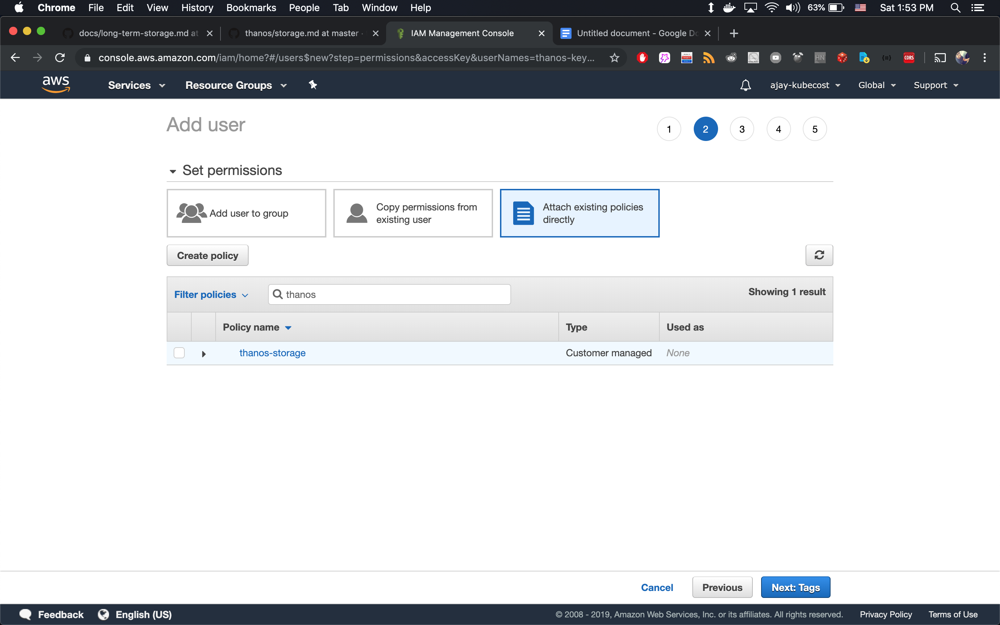
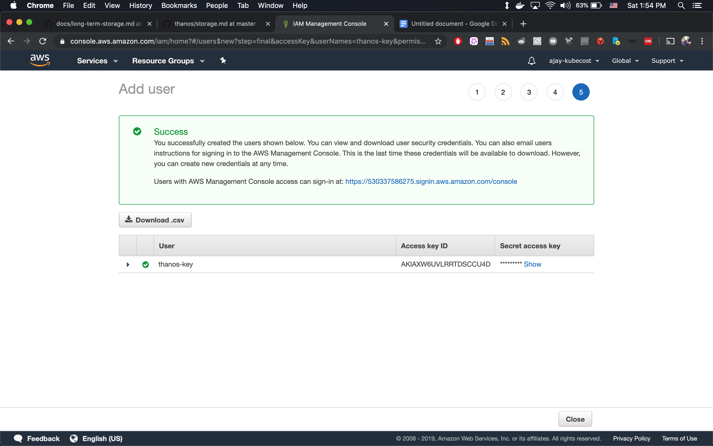

Creating a Thanos IAM Policy
============================
In order to create an AWS IAM policy for use with Thanos:

1.  Navigate to the AWS console and select *IAM*.

2. Select *Policies* in the Navigation menu, then select *Create Policy*.

3. Add the following JSON in the policy editor:

    > **Note:** Make sure to replace `<your-bucket-name>` with the name of your newly created S3 bucket

    ```
    {
        "Version": "2012-10-17",
        "Statement": [
            {
                "Sid": "Statement",
                "Effect": "Allow",
                "Action": [
                    "s3:ListBucket",
                    "s3:GetObject",
                    "s3:DeleteObject",
                    "s3:PutObject",
                    "s3:PutObjectAcl"
                ],
                "Resource": [
                    "arn:aws:s3:::<your-bucket-name>/*",
                    "arn:aws:s3:::<your-bucket-name>"
                ]
            }
        ]
    }
    ```

4. Select _Review policy_ and name this policy, e.g. `kc-thanos-store-policy`

5. Navigate to _Users_ in IAM control panel, then select _Add user_

6. Provide a username (e.g. `kubecost-thanos-service-account`) and select _Programmatic access_.

7. Select _Attach existing policies directly_, search for the policy name provided in Step 4, then create the user.

    

8. Capture your Access Key ID and secret in the view below:

    

If you don’t want to use a service account, IAM credentials retrieved from an instance profile are also supported.
You must get both access key and secret key from the same method (i.e. both from service or instance profile). More info on retrieving credentials [here](https://thanos.io/tip/thanos/storage.md/).
