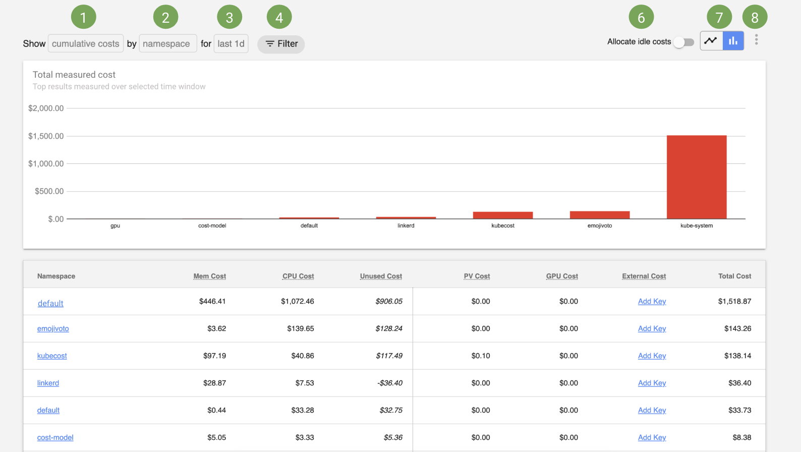

# Kubernetes Cost Allocation

The Kubecost Allocation view allows you to quickly see allocated spend across all native Kubernetes concepts, e.g. namespace, k8s label, and service. It also allows for allocating cost to organizational concepts like team, product/project, department, or environment. This document explains the metrics presented and describes how you can control the data displayed in this view.



### 1. Displayed metrics  
View either cumulative or run rate costs measured over the selected time window based on the resources allocated. 

* Cumulative Costs -- represents the actual/historical spend captured by the Kubecost agent over the selected time window
* Rate metrics -- hourly, daily, or monthly "run rate" cost, also used for projected cost figures, based on samples in the selected time window 

Costs allocations are based on the following:

1) resources allocated, i.e. max of resource requests and usage  
2) the cost of each resource  
3) the amount of time resources were provisioned  

For more information, refer to this [FAQ](https://github.com/kubecost/cost-model#frequently-asked-questions) on how each of these inputs is determined based on your environment.

### 2. Aggregation  
Aggregate cost by namespace, deployment, service and other native Kubernetes concepts. 

Costs aggregations are also visible by other meaningful organizational concepts, e.g. Team, Department, and Product. These aggregations are based on Kubernetes labels, referenced at both the pod and namespace-level, with labels at the pod-level being favored over the namespace label when both are present. The Kubernetes label name used for these concepts can be configured in Settings or in [values.yaml](https://github.com/kubecost/cost-analyzer-helm-chart/blob/19908983ed7c8d4ff1d3e62d98537a39ab61bbab/cost-analyzer/values.yaml#L427-L445) after setting `kubecostProductConfigs.labelMappingConfigs.enabled` to true. Workloads without the relevent label will be shown as `__unallocated__`. 

> Kubernetes annotations can also be used for cost allocation purposes but this requires enabling a helm flag. [Learn more about using annotations](/annotations.md) 

To find what pods are not part of the relevant label set... you can either apply an `__unallocated__` label filter in this allocation view or explore variations of the following kubectl commands:  

```
kubectl get pods -l 'app notin (prometheus, cost-analyzer, ...)' --all-namespaces
kubectl get pods --show-labels -n <TARGET_NAMESPACE>
```

### 3. Time window  
The designated time window for measuring costs. Results for 1d, 2d, 7d, and 30d queries are cached by default.

### 4. Filter  
Filter resources by namespace, clusterId, and Kubernetes label to more closely investigate a rise in spend or key cost drivers at different aggregations, e.g. Deployments or Pods. When a filter is applied, only resources with this matching value will be shown. These filters are also applied to external out-of-cluster asset tags. Supported filters are as follows:

| Fitler 	| Description         	|
|--------------------	|---------------------	|
| Namespace        	|  Limit results to workloads in a set of namespaces. |
| ClusterID        	|  Limit results to workloads in a set of clusters with matching IDs. Note: clusterID is passed in _values_ at install-time. |
| Label        	   |  Limit results to workloads with matching Kubernetes labels. Namespace labels are applied to all of its workloads. Supports filtering by `__unallocated__` field as well|
| Pod Prefix        	|  Limit results to workloads that begin with this string. |

Comma-seperated lists are supported to filter by multple categories, e.g. namespace filter equals `kube-system,kubecost`
   
### 5. Allocate Idle Cost  
Allocating idle costs proportionately distributes slack or idle _cluster costs_ to tenants. Specifically, this applies to resources that are provisioned but not being fully used or requested by a tenant. As an example, if your cluster is only 25% utilized, as measured by the max of resource usage and requests, applying idle costs would proportionately increase the cost of each pod/namespace/deployment by 4x. This feature can be enabled by default in Settings.

### 6. Chart selection  
Toggle to the bar chart view to see aggregated costs over the selected window, or the time series view to see cost changes over time.

### 7. Additional options  
View other options to export cost data to CSV or view help documentation.

### Cost metrics

Cost allocation metrics are available for both in-cluster and out-of-cluster resources. Here are short descriptions of each metric:

| Metric 	| Description         	|
|--------------------	|---------------------	|
| Memory cost        	| The total cost of memory allocated to this object, e.g. namespace or deployment. The amount of memory allocated is the greater of memory usage and memory requested over the measured time window. The price of allocated memory is based on cloud billing APIs or custom pricing sheets. [Learn more](https://github.com/kubecost/cost-model#questions)|
| CPU Cost        	| The total cost of CPU allocated to this object, e.g. namespace or deployment. The amount of CPU allocated is the greater of CPU usage and CPU requested over the measured time window. The price of allocated CPU is based on cloud billing APIs or custom pricing sheets. [Learn more](https://github.com/kubecost/cost-model#questions) |
| Cost Efficiency        	| The percentage of requested CPU & memory dollars utilizated over the measured time window. Values range from 0 to above 100 percent. Workloads with no requests but with usage OR workloads with usage > request can report efficiency above 100%. [View Example](https://docs.google.com/spreadsheets/d/15CL2YrJHIcQyDMHu3vB3jXdTdcqEntawmy5T3zsVZ_g/edit#gid=0)|
| Network Cost        	| The cost of network traffic based on internet egress, cross-zone egress, and other billed transfer. Note: these costs must be enabled. [Learn more](http://docs.kubecost.com/network-allocation)|
| PV Cost        	| The cost of persistent storage volumes claimed by this object. Prices are based on cloud billing prices or custom pricing sheets for on-prem deployments. |
| GPU Cost        	| The cost of GPUs requested by this object, as measured by [resource limits](https://kubernetes.io/docs/concepts/configuration/manage-compute-resources-container/). Prices are based on cloud billing prices or custom pricing sheets for on-prem deployments. |
| Shared Cost        	| The cost of shared resources allocated to this tenant. This field covers shared overhead, shared namespaces, and shared labels. |
| External Cost        	| The cost of out-of-cluster resources allocated to this object. For example, S3 buckets allocated to a particular Kubernetes deployment. Prices are based on cloud billing data and require a key. This feature is currently available for AWS ([learn more](http://docs.kubecost.com/aws-out-of-cluster.html)) and GCP ([learn more](http://docs.kubecost.com/gcp-out-of-cluster.html)). |
