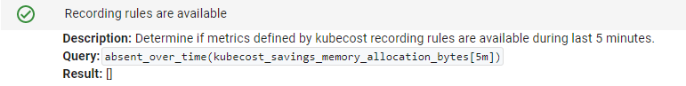
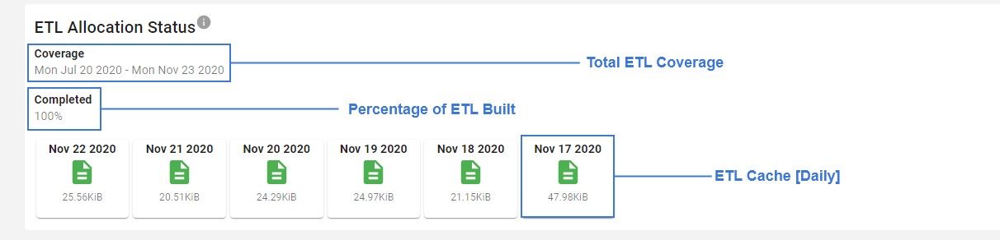
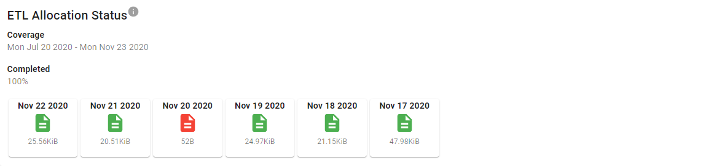

# Kubecost Diagnostics
Kubecost diagnostics run a series of tests to determine if resources necessary for accurate cost reporting are available.

As of release v1.70.0, the results of these tests are displayed at `<your-kubecost-endpoint>/diagnostics.html` and are also accessible via links from Settings.

### Cadvisor metrics available

Cadvisor metrics are generated by cadvisor directly and are required for core application functionality, including Kubecost Allocation and Savings insights.

If this diagnostic test is failing, view [How to Troubleshoot Missing Metrics](#how-to-troubleshoot-missing-metrics).

### Kube-state-metrics metrics available

A limited set of kube-stat-metrics data is required for core application functionality, including Kubecost Allocation and Savings insights.

If this diagnostic test is failing, view [How to Troubleshoot Missing Metrics](#how-to-troubleshoot-missing-metrics).

### Kubecost metrics available

Kubecost metrics are generated by the kubecost-cost-analyzer pod and are required for the core application to function, specific these metrics are used for Kubecost Allocation, Assets, and Savings functionality.

If this diagnostic test is failing, view [How to Troubleshoot Missing Metrics](#how-to-troubleshoot-missing-metrics).

### Node-exporter metrics available

Node exporter metrics are used for the following features:

* Reserved Instance Recommendations in Savings
* Show a compute 'breakdown' on Overview's Resource Efficiency graph, i.e. system vs idle vs user. The Compute bar on this graph will appear as a single solid colored bar when this diagnostic is failing.
* Various Kubecost Grafana dashboards

These metrics are not used in the core Assets and Allocation and therefore can be considered optional. [Learn how to disable](http://docs.kubecost.com/getting-started#node-exporter)

If this diagnostic test is failing and you'd like to have these metrics, view [How to Troubleshoot Missing Metrics](#how-to-troubleshoot-missing-metrics).

### Recording rules are available

The recording rules used by Kubecost are added via our helm installer [values.yaml](https://github.com/kubecost/cost-analyzer-helm-chart/blob/d01434f0489e110beb1bd727310f60c0b15744ec/cost-analyzer/values.yaml#L257-L298) and are used to improve query performance and efficiency. Specific features in Savings require the presence of these recording rules in order to function, so we provide a diagnostic to identify whether or not your install is using the custom recording rules.



If the recording rule diagnostic fails, use the configuration from our helm chart's [values.yaml](https://github.com/kubecost/cost-analyzer-helm-chart/blob/d01434f0489e110beb1bd727310f60c0b15744ec/cost-analyzer/values.yaml#L257-L298) to create them.

You can verify diagnostics have been added to Prometheus by port-forwarding into Prometheus and visiting Status > Rules. Here is an example command to connect if you've installed Kubecost in the kubecost namespace:

`kubectl port-forward -n kubecost service/kubecost-prometheus-server -n kubecost 9003:80`

You should see the following:


### Expected kube-state-metrics version found

Kubecost requests `kube-state-metrics >= v1.6.0`. This version check is completed with verifying the existence of the `kube_persistentvolume_capacity_bytes` metric. If this diagnostic test is failing, we recommend you:

1. Confirm kube-state-metrics version requirement is met<br/>
2. Verify this, and potentially other, kube-state-metrics metrics are not being dropped with Prometheus relabel rules<br/>
3. Determine if no persistent volumes are present in this cluster -- if so, you can ignore this diagnostic check<br/>

## Kubecost ETL pipeline metrics

A diagnostic view is provided for both the Allocation and Assets pipelines, and is designed to assist in diagnosing missing data found in the Allocation or Assets views. Kubecost's ETL pipelines run in the background to build a daily composition of the data required to build the cost model. For each day the data is collected, a file is written to disk containing the results. These files are used as both a cache and data backup, which the diagnostic view displays:



In the event of a problem, the diagnostic view would help you identify specific days where the ETL pipeline failed to collect data.



Note the file on `Nov 20, 2020` in the above image appears in <span style="color:red">**red**</span>. The data in this file has been flagged by our diagnostics page as *empty* (failed to pass a minimum size threshold). This could happen if the database was temporily unavailable while building that day.

The ETL pipelines provide a way to repair a specific day in the pipeline using the following URL:
```
http://<kubecost-url>:<port>/model/etl/[allocation|asset]/repair?window=<RFC3339-start>,<RFC3339-end>
```

In order to repair the file for the problematic date above (Note it's for _Allocation_), navigate to the following in a browser:
```
http://<kubecost-url>:<port>/model/etl/allocation/repair?window=2020-11-20T00:00:00Z,2020-11-21T00:00:00Z
```

NOTE: previous versions of Kubecost (1.81.0 and prior) provided a similar repair feature under the "rebuild" endpoint by passing a window:
```
http://<kubecost-url>:<port>/model/etl/[allocation|assets]/rebuild?window=<RFC3339-start>,<RFC3339-end>&commit=true
```

# How to Troubleshoot Missing Metrics

### Step 1. Confirm you are running the correct version of the metric exporter

Below are mininum required versions

```
node-exporter - v0.16 (May 18)
kube-state-metrics - v1.6.0 (May 19)
cAdvisor - kubelet v1.11.0 (May 18)
```

### Step 2. Confirm pod(s) are currently in a Running state

Confirm that each pod is in a `Running` state for the particular metric exporter. For example, you can confirm that a `kube-state-metrics` pod is Running with the following command:

```bash
kubectl get pod -l app.kubernetes.io/name=kube-state-metrics --all-namespaces
```

### Step 3. Verify that the required Prometheus Targets are available

You can see this information directly in the Kubecost Diagnostics page (screenshot below) or by visiting your Prometheus console and then Status > Targets in the top navigation bar.


If the necessary scrape target is not added to your Prometheus, then refer to [this resource](https://prometheus.io/docs/prometheus/latest/configuration/configuration/#scrape_config) to learn how to add a new job under your Prometheus `scrape_configs` block. You can visit `<your-prometheus-console-url>/config` to view the current scrape_configs block being passed to your Prometheus.

### Step 4. No recent Prometheus scrape errors

You can see information on recent Prometheus scrape errors directly in the Kubecost Diagnostics page when present or by visiting your Prometheus console and then Status > Targets in the top navigation bar.

Contact team@kubecost.com or send a message in our Slack workspace if you encounter an error that you do not recognize.

### Step 5. Metrics not being dropped with Prometheus relabel rules

If metrics are being collected on a supported version of the desired metrics exporter, the final step is to verify that individual metrics are not being dropped in your Prometheus pipeline. This could be in the form of an add or rule under a drop `metric_relabel_configs` block in your Prometheus yaml configuration files.
