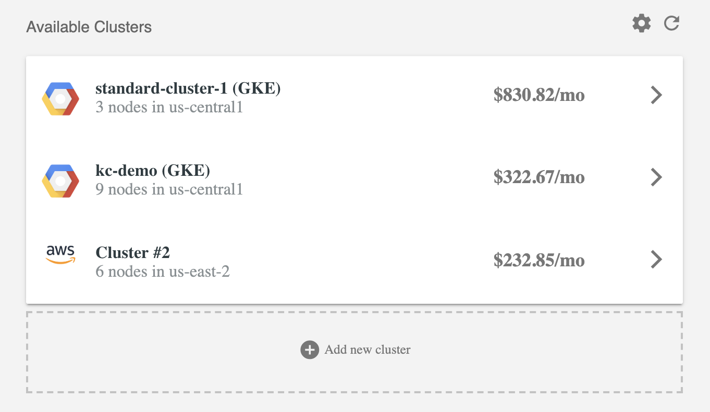

Kubecost supports the ability to view cost and health data across multiple Kubernetes clusters and cloud providers. 
Below are the steps for adding an additional cluster to your Kubecost frontend.

**Steps**

1. Install Kubecost on the additional cluster you would like to view. The recommended Kubecost install path is available at [kubecost.com/install](http://kubecost.com/install). 
2. Expose port 9090 of the `kubecost-cost-analyzer` pod. This can be done with a Kubernetes ingress ([example](https://github.com/kubecost/docs/blob/e82db0bff942dbb8abf6d74b979b10b121bce705/getting-started.md#basic-auth)) or loadbalancer ([example](https://github.com/kubecost/docs/blob/master/kubecost-lb.yaml)).  
3. Select Add new cluster on the Kubecost home page and provide the accessible URL for the target Kubecost installtion. 

