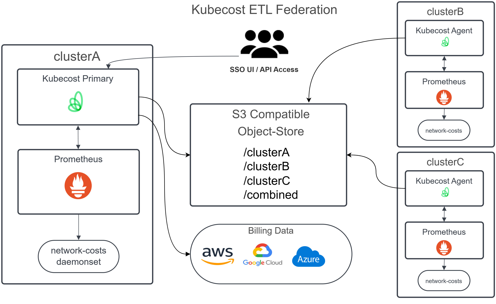

# Multi-Cluster

There are two options that Kubecost supports for environments with multiple clusters:

1. Kubecost Free gives visibility into a single cluster at a time, and requires the [Context Switcher](https://docs.kubecost.com/using-kubecost/context-switcher) to change your display to a different cluster. Each cluster performs its own cloud-billing reconciliation.
2. Kubecost Enterprise allows for a single-pane-of-glass view, which combines costs of all clusters in your environment into a single display. An agent on each cluster ships metrics to a shared storage bucket. A primary cluster serves the Kubecost UI, API endpoints, and performs global cloud-billing reconciliation for all clusters.

Cloud billing allows Kubecost to use actual billed costs for all resources instead of relying on on-demand rates. Learn more about Kubecost's cloud billing processes [here](https://docs.kubecost.com/install-and-configure/install/cloud-integration#kubecosts-cloud-processes).


Kubecost Free can now be installed on an unlimited number of individual clusters. Larger teams will benefit from using Kubecost Enterprise to better manage many clusters. See [pricing](https://www.kubecost.com/pricing) for more details.


## Primary and secondary clusters

In an Enterprise multi-cluster setup, the UI can only be accessed through one designated primary cluster. All other clusters in the environment are secondary. The primary cluster in your environment can be manually designated by setting the Helm flag `.Values.federatedETL.federator.enabled` to `true`. There will be no change in your collective display regardless of which cluster is the primary cluster, so setting it is up to personal preference.


Because the UI is only accessible through the primary cluster, Helm flags related to UI display are not applied to secondary clusters.


## Enterprise Federation


This feature is only supported for Kubecost Enterprise.


There are two primary methods to aggregate all cluster information back to a single Kubecost UI:

* [Kubecost ETL Federation (preferred)](federated-etl.md)
* [Thanos Federation](thanos-setup.md)

Both methods allow for greater compute efficiency by running the most resource-intensive workloads on a single primary cluster, and a lightweight agent on all other monitored clusters.

For environments that already have a Prometheus instance, ETL Federation may be preferred because only a single Kubecost pod is required.

The below diagrams highlight the two architectures:

**Kubecost ETL Federation (Preferred)**

<figure><figcaption>
ETL Federation Overview
</figcaption></figure>

**Kubecost Thanos Federation**

