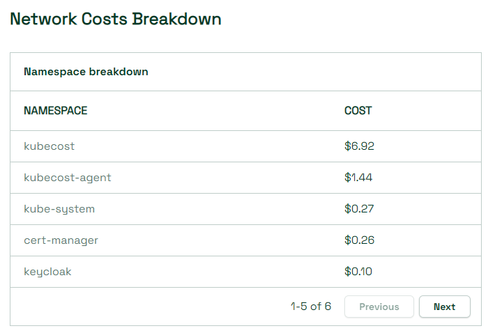

# Network Traffic Cost Allocation

This document describes how Kubecost calculates network costs.

## Network Cost Calculation Methodology

Kubecost uses best-effort to allocate network transfer costs to the workloads generating those costs. The level of accuracy has several factors described below.

There are two primary factors when determining how network costs are calculated: [Cloud Integration](./cloud-integration.md) and the existence of the [network costs daemonset](./network-allocation.md).

### Base Functionality

A default installation of Kubecost will use the onDemand rates for internet egress and proportionally assign those costs by pod using the metric `container_network_transmit_bytes_total`.

### Cloud Integration

Kubecost uses [cloud integration](/install-and-configure/advanced-configuration/cloud-integration) to pull actual cloud provider billing information.

Cloud providers allocate data transfers as line-items on a per-node basis. Kubecost will allocate network transfer costs based on each pod's share of `container_network_transmit_bytes_total` of its node.

This will result in a accurate node-based costs. However, it is only estimating the actual pod/application responsible for the network-transfer costs.

### Network Costs Daemonset

When you [enable the network costs daemonset](./network-costs-configuration.md), Kubecost has the ability to attribute the network-byte traffic to specific pods. This will allow the most accurate cost distribution, as Kubecost has per-pod metrics for source and destination traffic.

Without enabling cloud-integration, these prices will be based on public onDemand pricing.

### Both Cloud Integration and Network Cost Daemonset

Enabling both cloud-integration and the networkCosts daemonset allows Kubecost to give the most accurate data transfer costs to each pod.

### Limitations

At this time, there is a minor limitation where Kubecost cannot determine accurate costs for pods that use hostNetwork. These pods, today, will share all costs with the costs with the node.
