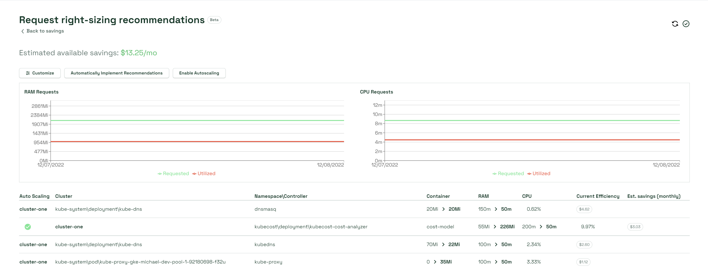

# 1-click Request Sizing

> **Note**: This feature is in a pre-release (alpha/beta) state. It has limitations. Please read the documentation carefully.

1-click request sizing is a feature that will instantly update [container resource requests](https://kubernetes.io/docs/concepts/configuration/manage-resources-containers/#requests-and-limits) in your cluster based on Kubecost's sizing [recommendations](api-request-right-sizing.md).

If you want to learn more about the APIs that power 1-click request sizing, including their limitations, see the corresponding [API documentation](api-request-recommendation-apply.md).

## Setup

See the high-level [automatic request right-sizing guide](auto-request-sizing.md).

## Using 1-click request sizing

1.  Select _Savings_ in the left navigation, then select _Right-size your container requests_. The Request right-sizing recommendations page opens.

    <figure><figcaption>
Request right-sizing recommendations Beta page
</figcaption></figure>
2.  Select _Customize_ to modify the request sizing settings, like profile, window, and filters, until you have a set of recommendations you are ready to apply to your cluster.

    <figure><figcaption></figcaption></figure>
3. Select _Automatically Implement Recommendations_. Select _Yes, apply the recommendation_ to confirm.
