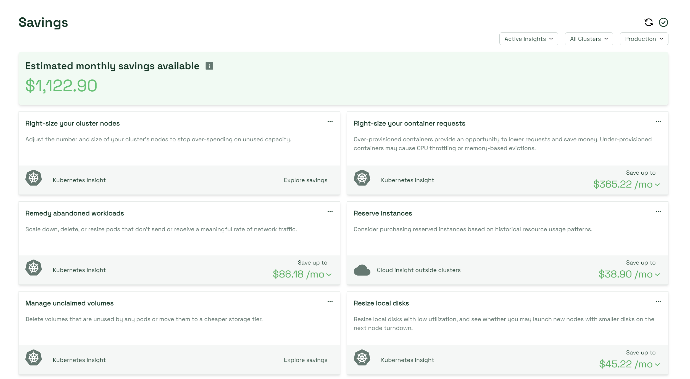

# Savings

The Savings page provides miscellaneous functionality to help you use resources more effectively and assess wasteful spending. In the center of the page, you will see your estimated monthly savings available. The savings value is calculated from all enabled Savings features, across your clusters and the designated cluster profile via dropdowns in the top right of the page.

<figure><figcaption>
The Savings page
</figcaption></figure>

## Savings panel features

The Savings page provides an array of panels containing different insights capable of lowering your Kubernetes and cloud spend.

### Kubernetes insights

* [Right-size your cluster nodes](https://docs.kubecost.com/using-kubecost/navigating-the-kubecost-ui/savings/cluster-right-sizing-recommendations)
* [Right-size your container requests](https://docs.kubecost.com/using-kubecost/navigating-the-kubecost-ui/savings/auto-request-sizing/one-click-request-sizing)
* [Remedy abandoned workloads](https://docs.kubecost.com/apis/apis-overview/api-abandoned-workloads)
* Manage unclaimed volumes
* Resize local disks
* Manage underutilized nodes
* Right-size your persistent volumes

### Cloud insights:

* Reserve instances
* Delete unassigned resources
* [Spot Instances](https://docs.kubecost.com/using-kubecost/navigating-the-kubecost-ui/savings/spot-checklist)

## Archiving Savings insights

You can archive individual Savings insights if you feel they are not helpful, or you cannot perform those functions within your organization or team. Archived Savings insights will not add to your estimated monthly savings available.

To temporarily archive a Savings insight, select the three horizontal dots icon inside its panel, then select _Archive._ You can unarchive an insight by selecting _Unarchive_.

You can also adjust your insight panels display by selecting _View_. From the _View_ dropdown, you have the option to filter your insight panels by archived or unarchived insights. This allows you to effectively hide specific Savings insights after archiving them. Archived panels will appear grayed out, or disappear depending on your current filter.

## Single cluster insights

By default, the Savings page and any displayed metrics (For example, estimated monthly savings available) will apply to all connected clusters. You can view metrics and insights for a single cluster by selecting it from the dropdown in the top right of the Savings page.


Functionality for most cloud insight features only exists when _All Clusters_ is selected in the cluster dropdown. Individual clusters will usually only have access to Kubernetes insight features.


## Cluster profiles

On the Savings page, as well as on certain individual Savings insights, you have the ability to designate a cluster profile. Savings recommendations such as right-sizing are calculated in part based on your current cluster profile:

* Production: Expects stable cluster activity, will provide some extra space for potential spikes in activity.
* Development: Cluster can tolerate small amount of instability, will run cluster somewhat close to capacity.
* High availability: Cluster should avoid instability at all costs, will size cluster with lots of extra space to account for unexpected spikes in activity.
