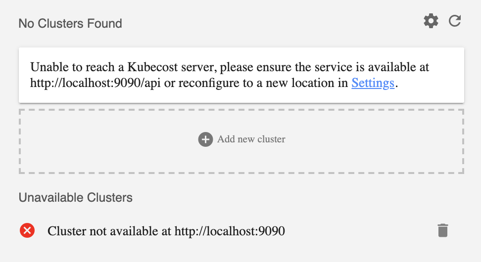

[No persistent volumes available...](#persistent-volume)    
[Unable to establish a port-forward connection](#port-forward)  
[FailedScheduling node-exporter](#node-exporter)   
[No clusters found](#no-cluster)


## <a name="persistent-volume"></a>Issue: no persistent volumes available for this claim and/or no storage class is set 

Your clusters needs a default storage class for the Kubecost and Prometheus persistent volumes to be successfully attached.

To check if a storage class exists, you can run

```kubectl get storageclass```

You should see a storageclass name with (default) next to it as in this example. 

<pre>
NAME                PROVISIONER           AGE 
standard (default)  kubernetes.io/gce-pd  10d
</pre>

If you see a name but no (default) next to it, run 

```kubectl patch storageclass <name> -p '{"metadata": {"annotations":{"storageclass.kubernetes.io/is-default-class":"true"}}}'```

If you don’t see a name, you need to add a storage class. For help doing this, see the following guides:

* AWS: [https://docs.aws.amazon.com/eks/latest/userguide/storage-classes.html](https://docs.aws.amazon.com/eks/latest/userguide/storage-classes.html)
* Azure: [https://kubernetes.io/docs/concepts/storage/storage-classes/#azure-disk](https://kubernetes.io/docs/concepts/storage/storage-classes/#azure-disk)


## <a name="port-forward"></a>Issue: unable to establish a port-forward connection

First, check the status of pods in the target namespace:

`kubectl get pods -n kubecost`

You should see the following pods running

<pre>
NAME                                                     READY   STATUS    RESTARTS   AGE
kubecost-cost-analyzer-599bf995d4-rq8g8                  3/3     Running   2          5m
kubecost-grafana-5cdd75755b-5s9j9                        1/1     Running   0          5m
kubecost-prometheus-kube-state-metrics-bd985f98b-bl8xd   1/1     Running   0          5m
kubecost-prometheus-node-exporter-24b8x                  1/1     Running   0          5m
kubecost-prometheus-node-exporter-4k4w8                  1/1     Running   0          5m
...
kubecost-prometheus-node-exporter-vxpw8                  1/1     Running   0          5m
kubecost-prometheus-node-exporter-zd6rd                  1/1     Running   0          5m
kubecost-prometheus-pushgateway-6f4f8bbfd9-k5r47         1/1     Running   0          5m
kubecost-prometheus-server-6fb8f99bb7-4tjwn              2/2     Running   0          5m
</pre>

If the cost-analyzer or prometheus-server __pods are missing__, we recommend reinstalling with Helm using `--debug` which enables verbose output. 

If any __pod is not Running__ other than cost-analyzer-checks, you can use the following command to find errors in the recent event log:

`kubectl describe pod <pod-name> -n kubecost`

Should you encounter an unexpected error, please reach out for help on  [Slack](https://join.slack.com/t/kubecost/shared_invite/enQtNTA2MjQ1NDUyODE5LTg0MzYyMDIzN2E4M2M5OTE3NjdmODJlNzBjZGY1NjQ3MThlODVjMGY3NWZlNjQ5NjIwNDc2NGU3MWNiM2E5Mjc) or via email at [team@kubecost.com](team@kubecost.com). 


## <a name="node-exporter"></a>Issue: FailedScheduling kubecost-prometheus-node-exporter

If one has an existing `node-exporter` daemonset, the Kubecost Helm chart may timeout due to a conflict. You can disable the installation of `node-exporter` by passing the following parameters to the Helm install.

```
helm install kubecost/cost-analyzer --debug --wait --namespace kubecost --name kubecost \
    --set kubecostToken="<INSERT_YOUR_TOKEN>" \
    --set prometheus.nodeExporter.enabled=false \
    --set prometheus.serviceAccounts.nodeExporter.create=false
 ```


## <a name="no-cluster"></a>Issue: Unable to connect to a cluster

You may encounter the following screen if the Kubecost frontend is unabled to connect with a live Kubecost server.



Recommended troubleshooting steps are as follows:

First, point your browser to the `/api` endpoint on your target URL. For example, visit `http://localhost:9090/api/` in the scenario shown above. You should expect to see a Prometheus config file at this endpoint.  

If you are unable to successfully retrieve your config file from this endpoint, we recommend the following:

1. Check your connection to this host
2. View the status of all Prometheus and Kubecost pods to see if any pods are experiencing errors or are in a Pending state. When performing the default Kubecost install we recommend inspecting this with `kubectl get pods -n kubecost`. All pods should be either Running or Completed.
3. View relevent pod logs if any pod is not in the Running or Completed state.

If your cluster address has changed, you can visit Settings in the Kubecost product to update or you can also add a new cluster. 

Please contact us at team@kubecost.com or on Slack at any point.

