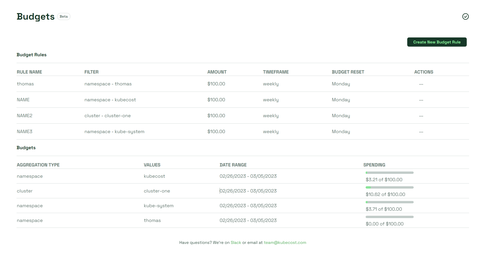
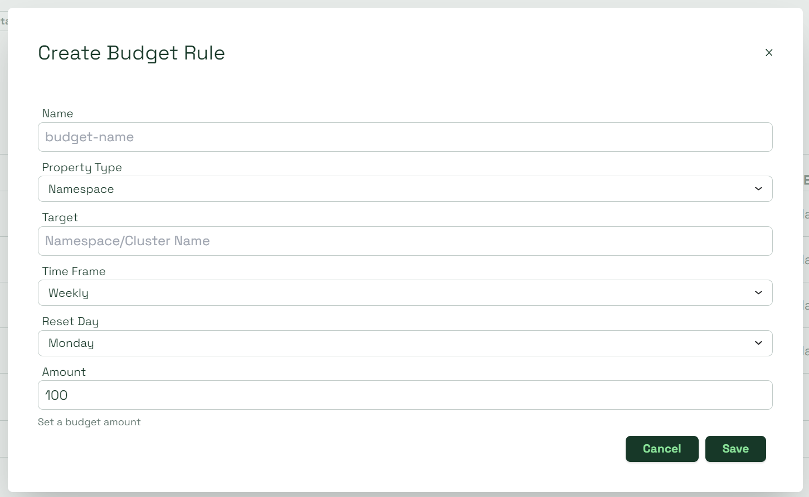
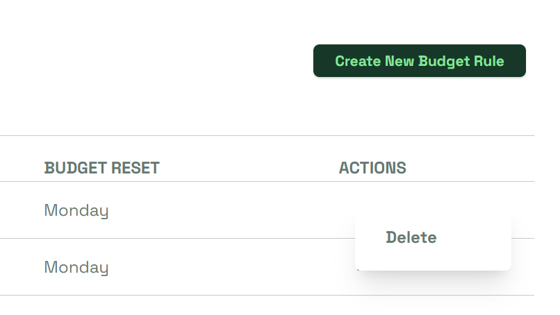

# Budgets

> **Note:** The Budgets dashboard is currently in beta. Please read the documentation carefully.

Recurring budget rules are a way of establishing spend limits for your clusters or namespaces. They can be created in moments using the Budget dashboard.

<figure><figcaption>
Budgets dashboard
</figcaption></figure>

### Creating a budget

Begin by selecting the _Create New Budget Rule_ button in the top right corner of the dashboard. The Create Budget Rule window opens.

<figure><figcaption>
Create Budget Rule
</figcaption></figure>

* _Name_: The name of your budget
* _Property Type:_ Either namespace or cluster
* _Target_: Name of your existing namespace or cluster you want to create a budget for
* _Time frame_: Time frame of your budget rule before it resets. Either weekly or monthly.
* _Reset Day_: Specific day the budget rule resets, based on the selected Interval.
* _Amount_: Amount of your budget

Finalize your budget by selecting _Save_. Your recurring budget rule has been created and should appear on the dashboard.

#### Creating budget rules for multiple clusters or namespaces

It's possible to create a single budget rule for multiple clusters or namespaces (must be from the same property type) by using a wildcard suffix for the _Target_ field. By adding an asterisk at the end of your input, the budget rule will affect all targets that begin with the input. For example, if the _Property Type_ is Namespace and the _Target_ input is `kube*`, the created budget rule will apply for all namespaces whose names begin with `kube`.

### Deleting a budget

If you want to delete a budget, select the meatballs icon for your rule under the Actions column.

Selecting _Delete_ will open the Delete Budget window. Confirm deletion by selecting _Delete_.

<figure><figcaption>
Deleting a budget
</figcaption></figure>
