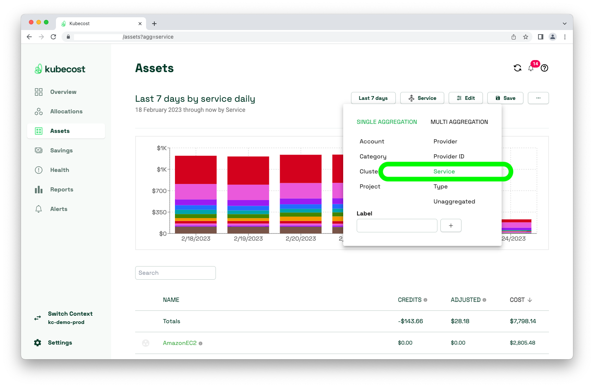
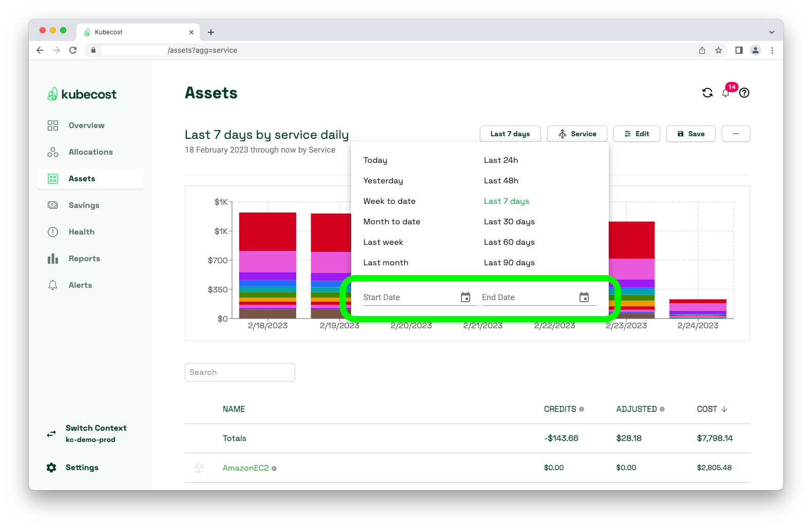
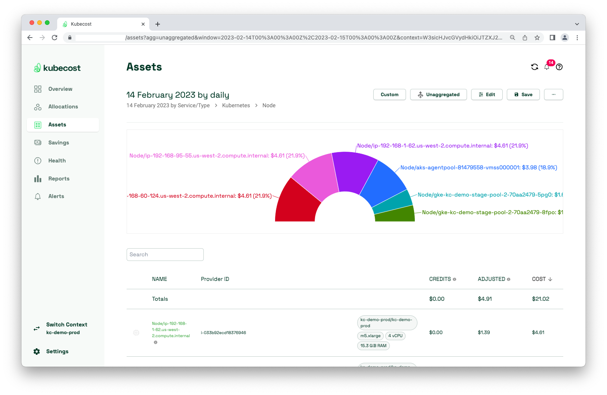
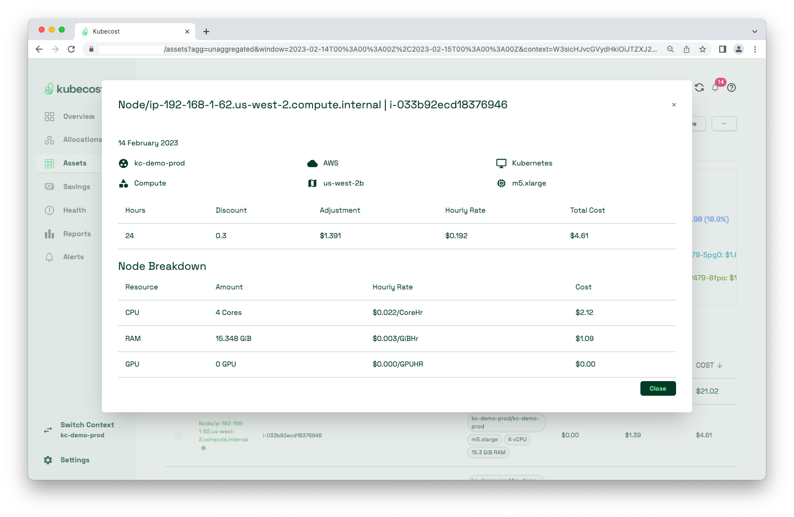
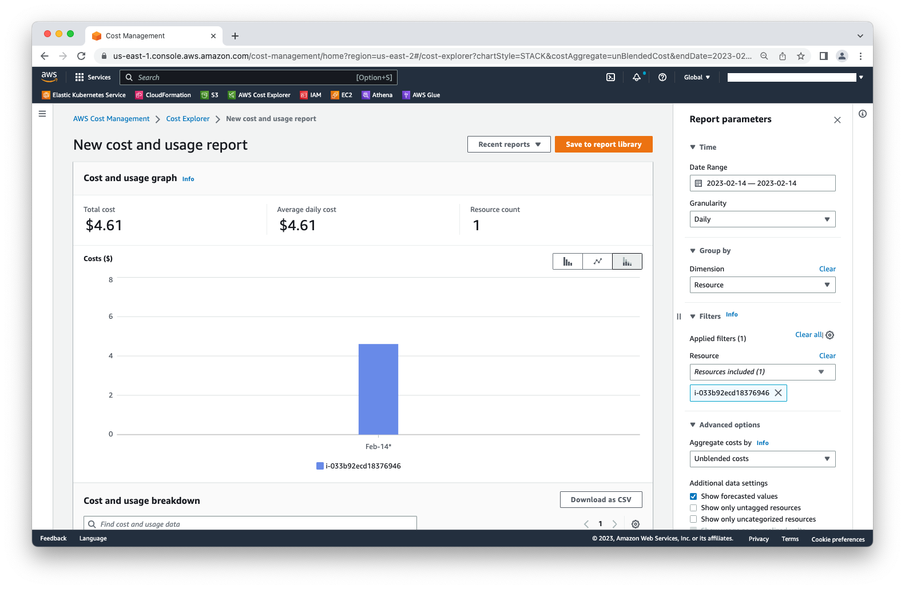
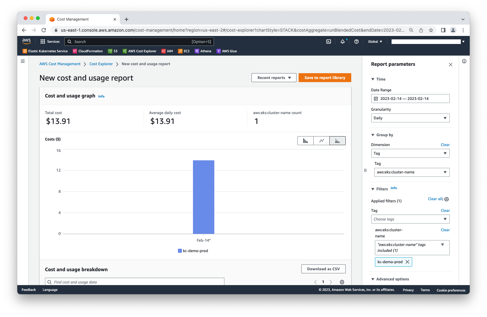
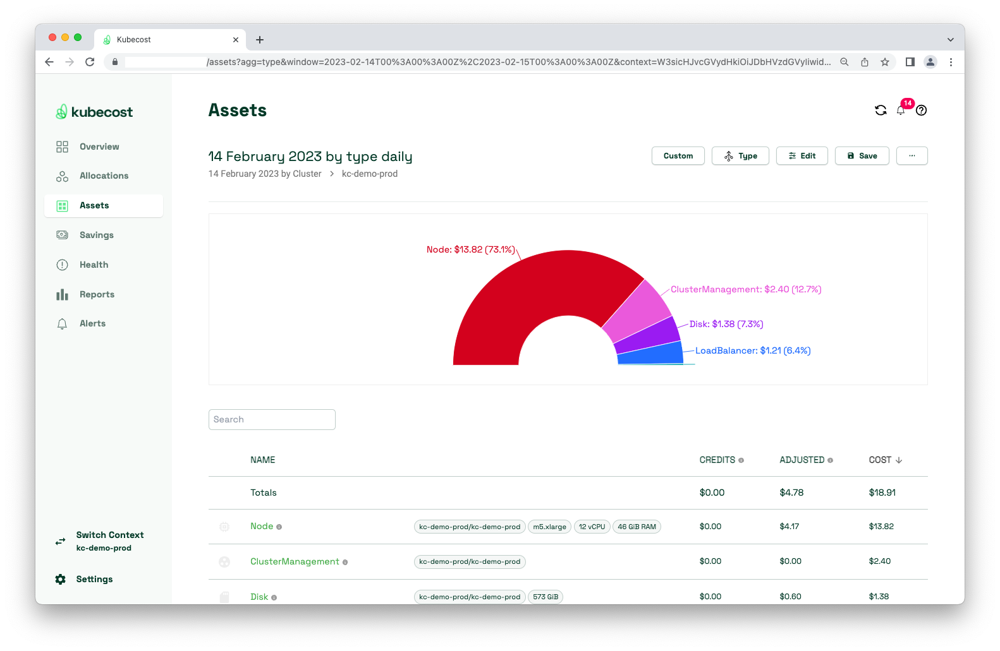

# AWS/Kubecost Data Audit

### Prerequisite

Before comparing costs between Kubecost and AWS Cost Explorer, ensure your Kubecost deployment has configured [Cloud Billing Integrations](https://docs.kubecost.com/install-and-configure/install/cloud-integration/aws-cloud-integrations).

### Performing a data audit

1. Go to the Assets page, then select _Aggregate By_ > _Single Aggregation_ > _Service_.

    <figure><figcaption></figcaption></figure>

2. Audits are most effective when targeting small ranges of time. Select a Start and End Date which covers a window of 1 day, and is beyond 48 hours ago. Also select a date that has reconciled with the AWS Cost and Usage Report (CUR). CUR data can be delayed up to 24 hours.

    <figure><figcaption></figcaption></figure>

3. Select the _Kubernetes_ service from the table underneath the NAME column, then select _Node_. You should arrive at a page like this (if your information is displayed in a bar graph, you can change the display by selecting _Edit_, then _Entire Window_ under the Resolution dropdown):

    <figure><figcaption></figcaption></figure>

4. Select any node to view its details.

    <figure><figcaption></figcaption></figure>

5. Compare this instance's costs with what is found in AWS Cost Explorer (Amortized). The most accessible way of doing so is _Group by_ -> _Resource_, and _Filters -> Resource -> i-033b92ecd18376946._

    <figure><figcaption></figcaption></figure>

If unable to _Group by -> Resource_ (because it requires enabling hourly/resource granularity in Cost Explorer), try _Group by -> Tag -> aws:eks:cluster-name_, and _Filters -> Tag -> aws:eks:cluster-name -> kc-demo-prod_. This will compare the cost of a cluster in AWS Cost Explorer, versus the cost of a cluster in Kubecost.

> **Note**: When grouping by cluster, AWS Cost Explorer only accounts for the Node and Network costs. Not the ClusterManagement/ControlPlane, Disks, LoadBalancer costs. Also keep in mind this method will also be less exact than comparing a specific node between Kubecost and AWS Cost Explorer.

<figure><figcaption></figcaption></figure>

<figure><figcaption></figcaption></figure>

### Auditing other resources

This doc should be used for auditing Kubernetes assets whose costs in Kubecost get adjusted once reconciled with the CUR. Kubecost should present its cost data within a 5% margin of what Cost Explorer is presenting.

When Kubecost reports costs on non-Kubernetes assets, those numbers should be exact, as those should be directly derived from the CUR.

### Troubleshooting non-matching costs

* Investigate Prometheus to see if the underlying metrics about the node are sporadic or missing.
* Cost Explorer CSV export for one day filtered by account and service in AWS. Compare that to the Kubecost `/model/asset` API request for the same day.
* Set up CUR to export as CSV file. Investigate to see whether costs in CSV file match with Kubecost Assets page.
* Test Athena queries.
