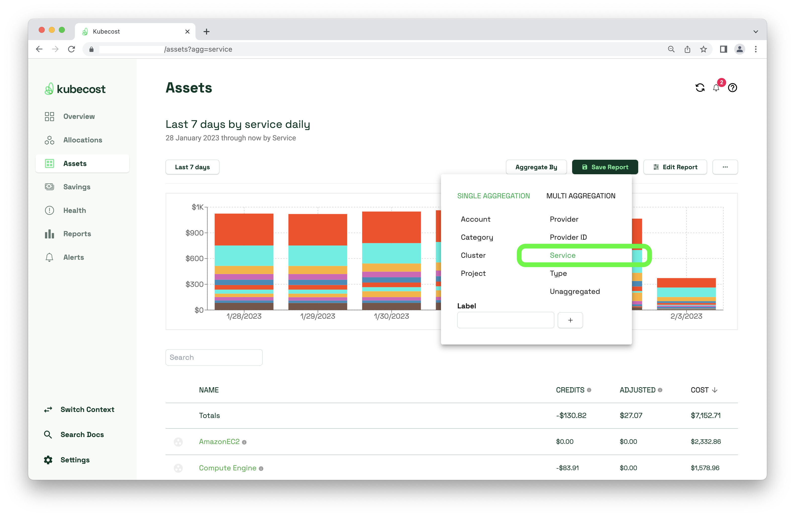
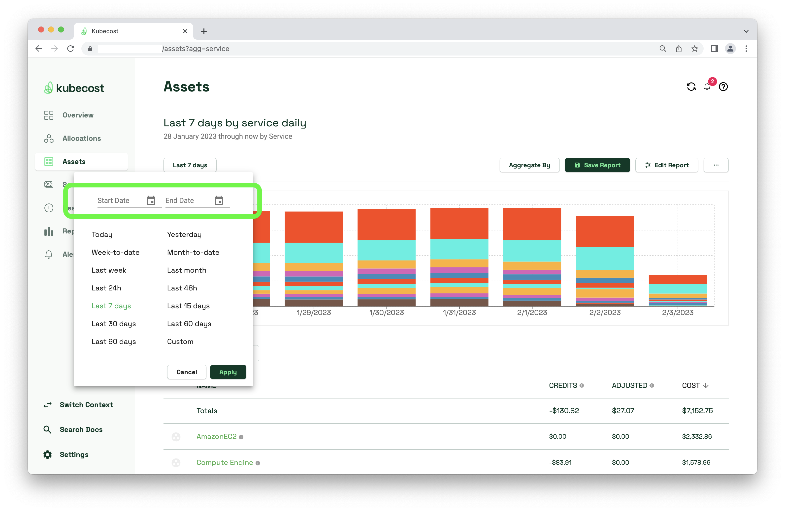
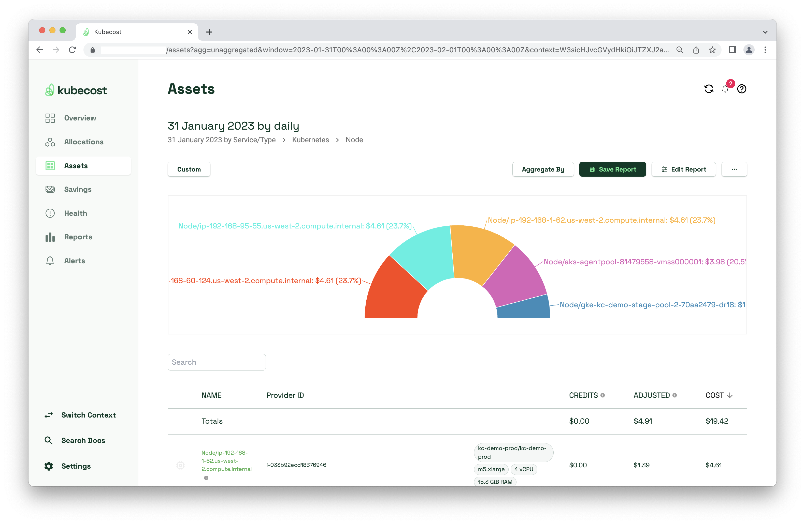
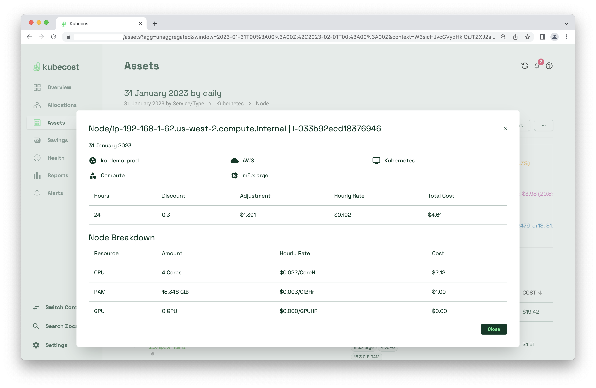
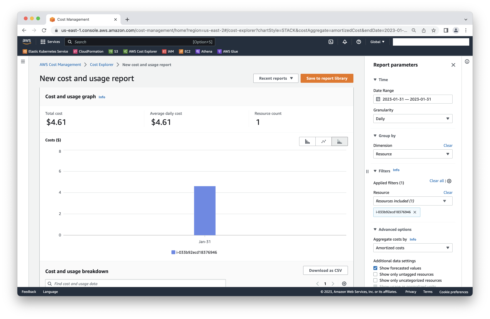
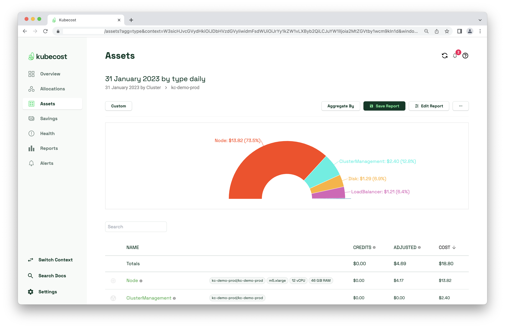

# AWS / Kubecost Data Audit

**Step 0**: Before comparing costs between Kubecost and AWS Cost Explorer, ensure your Kubecost deployment has configured [Cloud Billing Integrations](https://docs.kubecost.com/install-and-configure/install/cloud-integration/aws-cloud-integrations).

**Step 1**: Visit Kubecost Assets page and ensure you are aggregating by "Service"

<figure><figcaption></figcaption></figure>

**Step 2:** Select a Start and End Date which covers a window of 1 day, and is beyond 48hours ago. We want to target a small and specific date range when doing this audit. And we want to select a date that we know has reconciled with the AWS Cost and Usage Report (CUR). CUR data can be delayed up to 24hrs.

<figure><figcaption></figcaption></figure>

**Step 3**: Select the "Kubernetes" service, then select "Node". You should arrive at a page like this.

<figure><figcaption></figcaption></figure>

**Step 4**: Click on a Node to view its details.

<figure><figcaption></figcaption></figure>

**Step 5**: Compare this instance's costs with what is found in AWS Cost Explorer (Amortized). The most accessible way of doing so is **"Group by -> Resource"** and **"Filters -> Resource -> i-033b92ecd18376946"**

<figure><figcaption></figcaption></figure>

**Step 5a**: If unable to "Group by -> Resource" (because it requires enabling hourly/resource granularity in Cost Explorer), try **"Group by -> Tag -> aws:eks:cluster-name"**and **"Filters -> Tag -> aws:eks:cluster-name -> kc-demo-prod"**.

Note, these costs only account for the nodes and network costs. Not the ClusterManagement/ControlPlane, Disks, LoadBalancer.

This method is also more lossy than comparing a specific node between Kubecost and AWS Cost Explorer.

<figure><figcaption></figcaption></figure>

<figure><figcaption></figcaption></figure>

**Auditing other resources**: This doc primarily focused on Kubernetes Assets whose costs in Kubecost get adjusted once reconciled with the CUR. Kubecost should be presenting its cost data within a 5% margin of what Cost Explorer is presenting.

When Kubecost reports costs on non-Kubernetes Assets, those numbers should be exact, as those should be directly derived from the CUR.

**Additional troubleshooting if the costs aren't matching:**

* Investigate Prometheus to see if the underlying metrics about the node are sporadic or missing.
* Cost Explorer CSV export for one day filtered by account and service in AWS. Compare that to the Kubecost `/model/asset` API request for the same day.
* Set up CUR to export as CSV file. Investigate to see whether costs in CSV file match with Kubecost Assets page.
* Test Athena queries.
