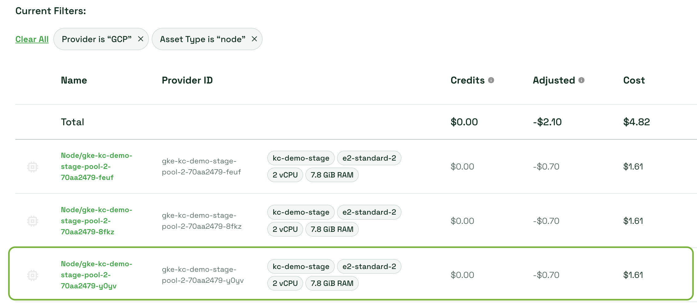
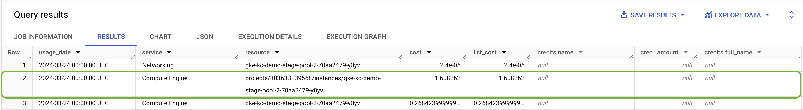
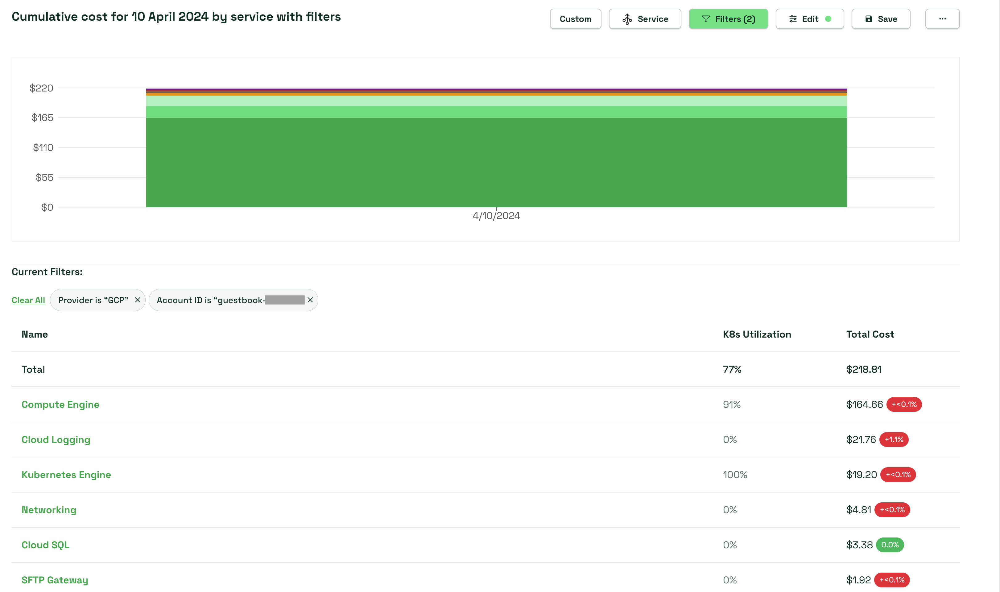
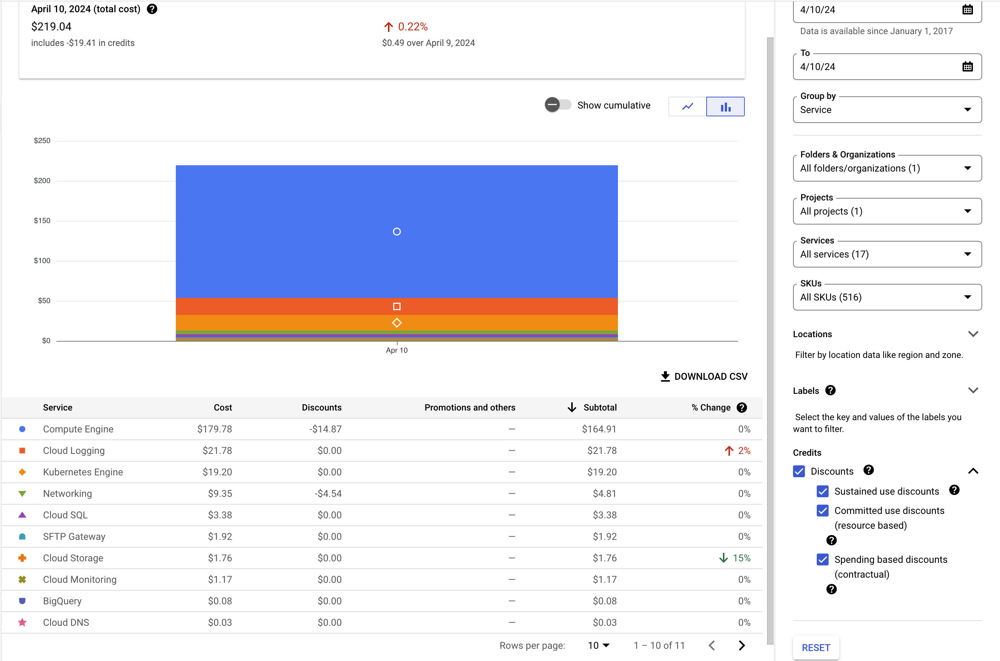

# AWS/Kubecost Data Audit

## Performing a cluster data audit

First, in the Kubecost UI, [view the price of a single node for a single day](./).



Next, compare this instance's costs with what is found in the GCP export via BigQuery. Use the providerID that's in Kubecost for the node as the resource.name in the following query:

```bash
SELECT
  TIMESTAMP_TRUNC(usage_start_time, day) as usage_date, 
  service.description as service,
  resource.name as resource,
  SUM(cost) as cost,
  SUM(cost_at_list) as list_cost,
  ARRAY_CONCAT_AGG(credits) as credits
FROM detailedbilling.gcp_billing_export_resource_v1_0121AC_C6F51B_690771
WHERE 
  usage_start_time >= "2024-03-24" 
  AND usage_start_time < "2024-03-25"
  AND resource.name like '%gke-kc-demo-stage-pool-2-70aa2479-y0yv'
GROUP BY
  usage_date,
  service,
  resource
```




> **Note**: The example above is auditing the GKE nodes associated with the cluster. BigQuery will return additional items such as network costs and costs associated with the node pool. The focus here is on GKE nodes only.

## Performing an Audit against GCP resources (services)

First, choose a window of 1 day greater than 48hrs in past and filter by a specific account and the GCP provider.




Next, compare the costs of services for the same account in the GCP billing console.

> **Note**: Total costs won't always be precise and may have a variance of 1-2%.


