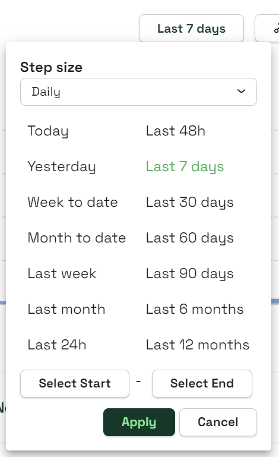
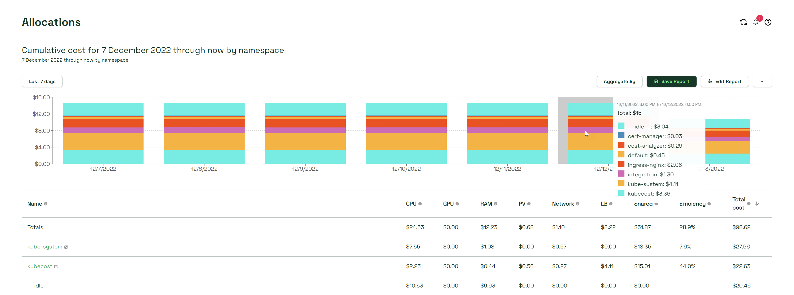
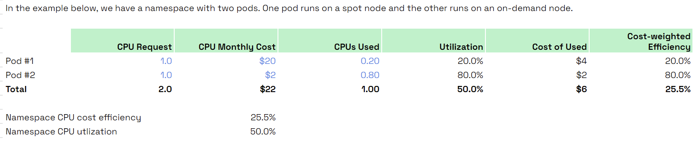

# Allocations Dashboard

The Kubecost Allocations dashboard allows you to quickly see allocated spend across all native Kubernetes concepts, e.g. namespace, k8s label, and service. It also allows for allocating cost to organizational concepts like team, product/project, department, or environment. This document explains the metrics presented and describes how you can control the data displayed in this view.


## Configuring your query

Kubecost provides a variety of options for configuring your allocations queries to view the information you need. Below is a table of the major configuration options, with in-depth explanations in this article for how they work.

| Element                 | Description                                                                                              |
| ----------------------- | -------------------------------------------------------------------------------------------------------- |
| Date Range              | Will report _Last 7 days_ by default. Manually select your start and end date, or choose a preset option |
| Aggregate By            | Aggregate costs by one or several concepts. Add custom labels                                            |
| Save/Unsave             | Save or unsave the current report                                                                        |
| Edit                    | Includes multiple filtering tools including cost metric and shared resources                             |
| Additional options icon | Additional options for opening and downloading reports                                                   |

### Date Range



Select the date range of the report, called the window, by setting specific start and end dates, or by using one of the preset options. You can use _Select Start_ and _Select End_ to establish custom date ranges as well.

#### Step size

Step size refers to the length of time of each group of data displayed on your dashboard across the window. Options are _Default_, _Daily_, _Weekly_, _Monthly_, and _Quarterly_. When retaining long periods of data through custom configurations (such as Prometheus), consider using larger step sizes to avoid potential display errors. The step size when selecting _Default_ is dependent on the size of your window.

### Aggregate By

Here you can aggregate cost by namespace, deployment, service, and other native Kubernetes concepts. While selecting _Single Aggregation_, you will only be able to select one concept at a time. While selecting _Multi Aggregation_, you will be able to filter for multiple concepts at the same time.


Service in this context refers to a Kubernetes object that exposes an interface to outside consumers.



When aggregating by namespace, the Allocations dashboard will only display namespaces that have or have had workloads running in them. If you don't see a namespace on this dashboard, you should confirm whether the namespace is running a workload.


Costs aggregations are also visible by other meaningful organizational concepts, e.g. Team, Department, and Product. These aggregations are based on Kubernetes labels, referenced at both the pod and namespace-level, with labels at the pod-level being favored over the namespace label when both are present. The Kubernetes label name used for these concepts can be configured in Settings or in [values.yaml](https://github.com/kubecost/cost-analyzer-helm-chart/blob/19908983ed7c8d4ff1d3e62d98537a39ab61bbab/cost-analyzer/values.yaml#L427-L445) after setting `kubecostProductConfigs.labelMappingConfigs.enabled` to `true`. Workloads without the relevant label will be shown as `__unallocated__`.


Kubernetes annotations can also be used for cost allocation purposes, but this requires enabling a Helm flag. [Learn more about using annotations](../../../install-and-configure/advanced-configuration/annotations.md). To see the annotations, you must add them to the label groupings via Settings or in [values.yaml](https://github.com/kubecost/cost-analyzer-helm-chart/blob/19908983ed7c8d4ff1d3e62d98537a39ab61bbab/cost-analyzer/values.yaml#L427-L445). Annotations will not work as one-off Labels added into reports directly, they will only work when added to the label groups in Settings or within the [values.yaml](https://github.com/kubecost/cost-analyzer-helm-chart/blob/19908983ed7c8d4ff1d3e62d98537a39ab61bbab/cost-analyzer/values.yaml#L427-L445).


To find what pods are not part of the relevant label set, you can either apply an `__unallocated__` label filter in this allocation view or explore variations of the following kubectl commands:

```
kubectl get pods -l 'app notin (prometheus, cost-analyzer, ...)' --all-namespaces
kubectl get pods --show-labels -n <TARGET_NAMESPACE>
```

### Filters

Filter allocation data by all available aggregation categories. When a filter is applied, only resources with this matching value will be shown. Supports advanced filtering options as well.

### Edit report

The _Edit_ icon has additional options for configuring your query such as how to display your data, adding filters, and configuring shared resources.

#### Idle Costs

Allocating [idle costs](/using-kubecost/navigating-the-kubecost-ui/cost-allocation/efficiency-idle.md#idle) proportionately distributes slack or idle _cluster costs_ to tenants. Idle refers to resources that are provisioned but not being fully used or requested by a tenant.

As an example, if your cluster is only 25% utilized, as measured by the max of resource usage and requests, applying idle costs would proportionately increase the cost of each pod/namespace/deployment by 4x. This feature can be enabled by default in Settings.

The idle costs dropdown allows you to choose how you wish your idle costs to be displayed:

* Hide: Hide idle costs completely.
* Separate: Idle costs appear as their own cost, visualized as a gray-colored bar in your graph.
* Share By Cluster: Idle costs are attributed to workloads, and grouped by the cluster they belong to.
* Share By Node: Idle costs are attributed to workloads, and grouped by the node they belong to.
* Separate By Cluster: Idle costs appear as their own cost, visualized as a gray-colored bar in your graph. The idle costs item in the table can be expanded to show the idle costs for each cluster.
* Separate By Node: Idle costs appear as their own cost, visualized as a gray-colored bar in your graph. The idle costs item in the table can be expanded to show the idle costs for each node.

To learn more about sharing idle costs, see [here](/using-kubecost/navigating-the-kubecost-ui/cost-allocation/efficiency-idle.md#sharing-idle).

#### Chart

View Allocation data in the following formats:

1. Cost over time: Cost per aggregation broken down over days or hours depending on date range
2. [Cost Forecast](/using-kubecost/forecasting.md): Cost over time with additional projected spend
3. Cost: Total cost per aggregation over date range
3. Efficiency over time: Shows resource efficiency over given date range
4. Proportional cost: Cost per aggregate displayed as a percentage of total cost over date range
5. Cost Treemap: Hierarchically structured view of costs in current aggregation

You can select _Edit_ > _Chart_ > _Cost over time_ from the dropdown to have your data displayed on a per-day basis. Hovering over any day's data will provide a breakdown of your spending.



#### Cost metric

View either cumulative or run rate costs measured over the selected time window based on the resources allocated.

* Cumulative Cost: represents the actual/historical spend captured by the Kubecost agent over the selected time window
* Rate metrics: Monthly, daily, or hourly "run rate" cost, also used for projected cost figures, based on samples in the selected time window

Costs allocations are based on the following:

1. Resources allocated, i.e. max of resource requests and usage
2. The cost of each resource
3. The amount of time resources were provisioned

For more information, refer to the [OpenCost spec](https://github.com/opencost/opencost/blob/develop/spec/opencost-specv01.md).

#### Shared resources

Select how shared costs set on the settings page will be shared among allocations. Pick from default shared resources, or select a custom shared resource. A custom shared resource can be selected in the Configure custom shared resources feature at the bottom of the _Edit_ window.

### Additional options

The three horizontal dots icon (directly next to _Save_) will provide additional options for handling your report:

* _Open Report_: Allows you to open one of your saved reports without first navigating to the Reports page
* _Alerts_: Send one of four reports routinely: recurring, efficiency, budget, and spend change
* _Download CSV_: Download your current report as a CSV file
* _Download PDF_: Download your current report as a PDF file

## Cost metrics table

Cost allocation metrics are available for both in-cluster and OOC resources:

| Metric                      | Description                                                                                                                                                                                                                                                                                                                                                                                                                  |
| --------------------------- | ---------------------------------------------------------------------------------------------------------------------------------------------------------------------------------------------------------------------------------------------------------------------------------------------------------------------------------------------------------------------------------------------------------------------------- |
| CPU                         | The total cost of CPU allocated to this object, e.g. namespace or deployment. The amount of CPU allocated is the greater of CPU usage and CPU requested over the measured time window. The price of allocated CPU is based on cloud billing APIs or custom pricing sheets. [Learn more](https://github.com/kubecost/cost-model#questions).                                                                                   |
| GPU                         | The cost of GPUs requested by this object, as measured by [resource limits](https://kubernetes.io/docs/concepts/configuration/manage-compute-resources-container/). Prices are based on cloud billing prices or custom pricing sheets for on-prem deployments. [Learn more](../../../architecture/gpu-allocation.md).                                                                                                        |
| RAM                         | The total cost of memory allocated to this object, e.g. namespace or deployment. The amount of memory allocated is the greater of memory usage and memory requested over the measured time window. The price of allocated memory is based on cloud billing APIs or custom pricing sheets. [Learn more](https://github.com/kubecost/cost-model#questions)                                                                     |
| Persistent Volume (PV) Cost | The cost of persistent storage volumes claimed by this object. Prices are based on cloud billing prices or custom pricing sheets for on-prem deployments.                                                                                                                                                                                                                                                                    |
| Network                     | The cost of network traffic based on internet egress, cross-zone egress, and other billed transfer. Note: these costs must be enabled. [Learn more](network-allocation.md). When Network Traffic Cost are not enabled, the Node network costs from the cloud service provider's [billing integration](../../../install-and-configure/install/cloud-integration/) will be spread proportionally based on cost weighted usage. |
| Load Balancer (LB) cost     | The cost of cloud-service load balancer that has been allocated.                                                                                                                                                                                                                                                                                                                                                             |
| Shared                      | The cost of shared resources allocated to this tenant. This field covers shared overhead, shared namespaces, and shared labels. Can be explored further via _Inspect Shared Costs_. Idle costs are not included in Shared costs.                                                                                                                                                                                             |
| Cost Efficiency             | The percentage of requested CPU & memory dollars utilized over the measured time window. Values range from 0 to above 100 percent. Workloads with no requests but with usage OR workloads with usage > request can report efficiency above 100%.                                                                                                                                                                             |

### Cost efficiency table example



### Additional options column

The rightmost column in the Allocations metrics table allows you to perform additional actions on individual line items (functionality will vary based on how you aggregate):

* _Inspect_: Opens an advanced cost overview of the namespace in a new tab.
* _Inspect Shared Costs_: Opens an advanced cost overview of your shared costs in a new tab.
* _View Right-Sizing_: Opens the [Container Request Right-Sizing Recommendations](../savings/container-request-right-sizing-recommendations.md) page in a new tab.
