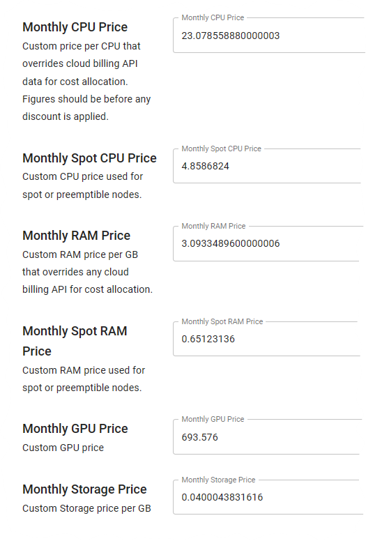

# Kubecost Pricing Sources

## Overview

There are multiple ways that Kubecost can be configured to pull in pricing data. This document outlines the different options and how to configure them.

## Detail

Kubecost supports the following pricing sources:

| Source | Detail | Pros | Cons |
|--|--|--|--|
| Cloud Provider OnDemand API | On by default Kubecost looks up public pricing APIs. | No configuration No maintenance | For users with significant discounts, Kubecost costs will be significantly higher than actual billing. |
| Custom Pricing | Manually set monhtly costs for: CPU, RAM, Storage, GPU, spot CPU, spot RAM | Simple configuration Does not require cloud provider access Works for on-prem clusters Completely air-gapped for highly-secure environements  | Accuracy dependent on value provided. Single rate per resource- no flexibility per node/storage types. |
| Cloud Provider Integrated (cloud-integration) | Kubecost pulls cloud provider billing every 6 hours When billing becomes available Kubecost reconciles the previously-estimated costs | Extremely accurate Little maintenance | Kubecost requires access to the billing account This setup can take time, especially if the team deploying Kubecost does not have access to the billing account. |
| CSV Pricing | Kubecost uses a user-provided CSV with granular resource prices. | Does not require cloud provider access Works for on-prem clusters Completely air-gapped for highly-secure environements | Mapping labels in the CSV can be tedious |

## Examples

- Cloud Provider OnDemand API: [AWS EC2](https://pricing.us-east-1.amazonaws.com/offers/v1.0/aws/AmazonEC2/current/us-east-2/index.json)

- Custom Pricing:

    

- Cloud Provider Integrated:

- CSV Pricing:

    
